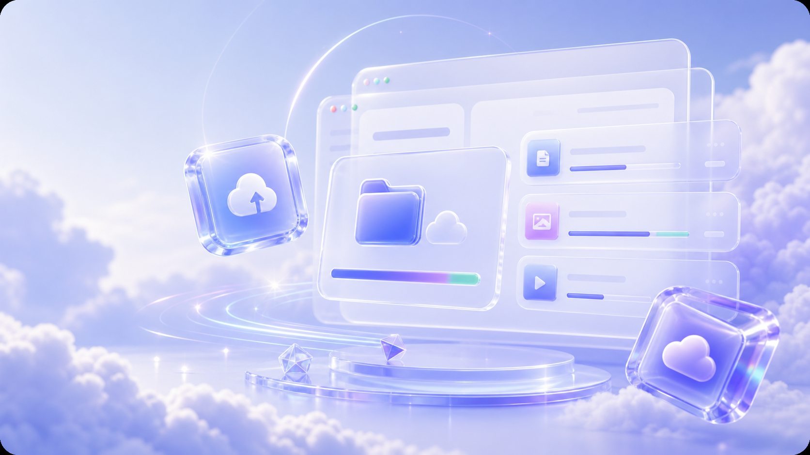
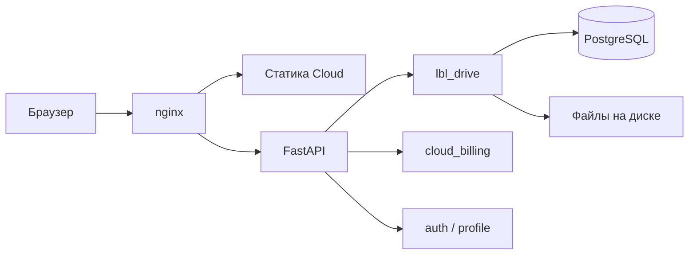

# LBL Cloud

**Облачное хранилище файлов** с веб-интерфейсом в духе Google Drive: папки, загрузка, тарифы, 2FA.

[](https://cloud.lbl3d.info)
[](https://cloud.lbl3d.info/app/)

<p align="center">
  
</p>

---

## О проекте

**LBL Cloud** — отдельный продукт экосистемы LBL: личное облако на домене `cloud.lbl3d.info`, не «раздел сайта студии». Пользователь регистрируется, получает квоту (от 5 ГБ бесплатно), работает с файлами в браузере и при необходимости подключает платный тариф.

Проект делался как **полноценный веб-сервис**: лендинг, SPA-подобное приложение `/app/` без React, REST API на FastAPI, оплата через ЮKassa, деплой за nginx.

| | |
|---|---|
| **Роль** | full-stack: UI/UX диска, клиентский JS, модули API, биллинг, деплой |
| **Статус** | в продакшене |
| **Период** | 2025–2026 |

Подробный разбор решений — в [docs/PROJECT.md](docs/PROJECT.md).

---

## Возможности

- **Мой диск** — дерево папок, сетка и список, хлебные крошки, поиск, недавние, избранное, корзина  
- **Загрузка** — drag-and-drop, простая и chunked-загрузка больших файлов (до лимита сервера)  
- **Превью и скачивание** — просмотр и выгрузка через API с проверкой прав  
- **Аккаунт** — профиль, 2FA по email, смена пароля, выход со всех устройств, история входов  
- **Тарифы** — Free / Pro / Team, оплата подписки, синхронизация статуса после ЮKassa  
- **Безопасность** — JWT в cookie, отдельный бренд писем для Cloud, валидация HTML/CSS на публичных страницах  

---

## Скриншоты

| Лендинг | Приложение |
|---------|------------|
| [cloud.lbl3d.info](https://cloud.lbl3d.info) | [cloud.lbl3d.info/app/](https://cloud.lbl3d.info/app/) |

<p align="center">
  
  &nbsp;&nbsp;
  
</p>

> Снимки экрана приложения и входа — в [docs/screenshots/](docs/screenshots/). Их можно добавить своими PNG для GitHub Pages / PDF портфолио.

---

## Стек

| Слой | Технологии |
|------|------------|
| Frontend | HTML5, CSS3, vanilla JavaScript (ES5+), Font Awesome |
| Backend | Python 3, FastAPI, SQLAlchemy, PostgreSQL |
| Инфра | nginx, uvicorn, ЮKassa |
| Auth | JWT (httpOnly cookie), 2FA по email |

Архитектура:



---

## Быстрый старт

### Посмотреть UI без сервера

```bash
cd frontend
python -m http.server 8766
# или из монорепо site: python backend/dev-serve-cloud.py
```

Открыть: [http://127.0.0.1:8766/app/?demo=1](http://127.0.0.1:8766/app/?demo=1) — демо-данные без API.

### API и прод

Рабочий backend — общий инстанс LBL (монтирование `lbl_drive` + `cloud_billing` в `main.py`). В этом репозитории — **исходники модулей Cloud и фронта**; секреты и полный `main.py` не публикуются.

Деплой: [docs/DEPLOY.md](docs/DEPLOY.md).

---

## Структура репозитория

```
LBL-Cloud/
├── frontend/
│   ├── landing/      # Главная cloud.lbl3d.info
│   ├── app/          # Веб-приложение «Мой диск»
│   ├── auth/         # Вход и регистрация
│   ├── billing/      # Тарифы
│   └── shared/js/    # Клиент API
├── backend/
│   ├── lbl_drive.py      # /api/drive/*
│   ├── cloud_billing.py  # /api/cloud/billing/*
│   └── snippets/         # Фрагменты auth/почты для документации
└── docs/                 # Документация (см. ниже)
```

---

## Документация

| Документ | Для кого |
|----------|----------|
| [docs/PROJECT.md](docs/PROJECT.md) | Портфолио: задача, решения, результат |
| [docs/API-CLOUD.md](docs/API-CLOUD.md) | Разработчик: эндпоинты API |
| [docs/CLOUD-APP-TZ.md](docs/CLOUD-APP-TZ.md) | ТЗ продукта |
| [docs/ТЕХНИЧЕСКАЯ-ДОКУМЕНТАЦИЯ-LBL-CLOUD.md](docs/ТЕХНИЧЕСКАЯ-ДОКУМЕНТАЦИЯ-LBL-CLOUD.md) | Пояснительная записка (учёба) |
| [docs/ЛИСТИНГИ-ПУТИ.md](docs/ЛИСТИНГИ-ПУТИ.md) | Приложение А: пути к листингам |

---

## Контакты

- **Автор:** [@Shivarin](https://github.com/Shivarin)  
- **Продукт:** [cloud.lbl3d.info](https://cloud.lbl3d.info)  
- **Студия:** [lbl3d.info](https://lbl3d.info) (смежный продукт, общий backend)

---

<p align="center">
  <sub>Сделано в рамках экосистемы LBL · 2026</sub>
</p>
