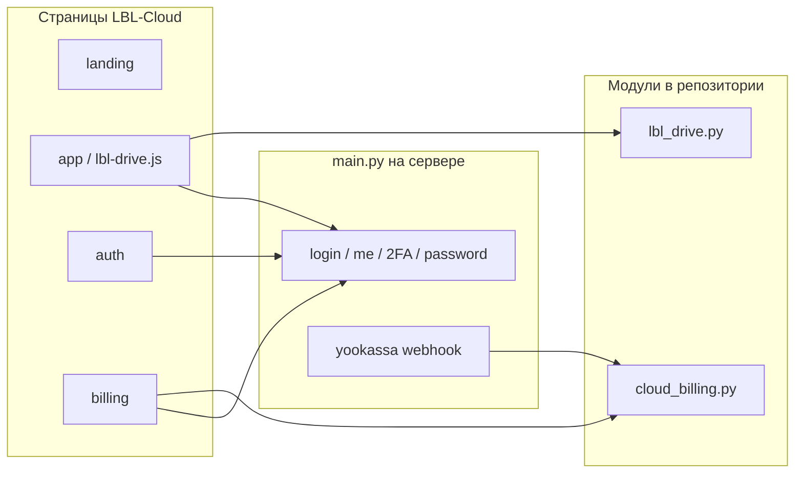

# API LBL Cloud — полный справочник

Документ описывает **все HTTP-эндпоинты**, которые использует [cloud.lbl3d.info](https://cloud.lbl3d.info), где лежит код в репозитории **LBL-Cloud** и что остаётся в основном проекте `site`.

Базовый URL API на проде: `https://cloud.lbl3d.info/api` (тот же backend, что и LBL Studio; для Cloud важен CORS и cookie на домене cloud).

---

## 1. Сводка: что в этом репозитории

| Область | Префикс | Файл в LBL-Cloud | Файл на сервере (полный backend) |
|---------|---------|------------------|----------------------------------|
| Диск | `/api/drive/*` | `backend/lbl_drive.py` | то же + `main.py` (монтирование) |
| Биллинг Cloud | `/api/cloud/billing/*` | `backend/cloud_billing.py` | то же + webhook в `main.py` |
| Вход, регистрация, 2FA, пароль | `/api/login`, `/api/register`, … | **нет** | `backend/main.py` |
| Профиль | `/api/me`, `/api/change-password`, … | **нет** | `backend/main.py` |
| Публичное | `/api/public/registration-status` | **нет** | `backend/main.py` |
| Webhook ЮKassa | `/api/payments/yookassa/webhook` | **нет** | `backend/main.py` → `cloud_billing` |

**Вывод:** репозиторий GitHub содержит **полный код модулей диска и биллинга** и **весь фронт Cloud**. Запуск API «с нуля» только из LBL-Cloud **невозможен** без `main.py`, `database.py`, `.env` и PostgreSQL.

---

## 2. Аутентификация

Используется JWT в **httpOnly cookie** (после `login` / `register`). Защищённые методы требуют cookie или заголовок `Authorization: Bearer <token>` (см. `get_current_user` в `main.py`).

### 2.1. Вход

| | |
|---|---|
| **Метод** | `POST /api/login` |
| **Код** | `site/backend/main.py` |
| **Клиент** | `frontend/auth/auth.js`, `frontend/shared/js/api.js` |

**Тело (JSON):**

```json
{
  "email": "user@example.com",
  "password": "••••••",
  "two_factor_code": "123456",
  "app_context": "cloud"
}
```

| Ответ | Условие |
|-------|---------|
| `200` + cookie + `{ "access_token", "token_type" }` | Успешный вход |
| `200` + `{ "requires_2fa": true, "message": "..." }` | Включена 2FA, код отправлен на email (и опционально VK) |
| `401` | Неверный email/пароль или код 2FA |

`app_context: "cloud"` — письма с брендом LBL Cloud (`utils.resolve_email_brand`).

### 2.2. Регистрация

| | |
|---|---|
| **Метод** | `POST /api/register` |
| **Код** | `main.py` |
| **Клиент** | `auth.js` |

**Тело:** `email`, `password`, `first_name`, `last_name`, `consent_personal_data`, опционально `referral_code`, `app_context`.

При регистрации выставляется `storage_limit_mb` (минимум `LBL_CLOUD_FREE_MB`, по умолчанию 5120 = 5 ГБ).

### 2.3. Восстановление пароля

| Метод | Клиент |
|-------|--------|
| `POST /api/forgot-password` | `auth.js` (`app_context: "cloud"`) |
| `POST /api/reset-password/confirm` | страница сброса (если есть на домене) |

### 2.4. Выход

| Метод | Описание |
|-------|----------|
| `POST /api/logout` | Очистка cookie текущей сессии |

### 2.5. Публичный статус регистрации

| | |
|---|---|
| **Метод** | `GET /api/public/registration-status` |
| **Клиент** | `api.js` → `getPublicRegistrationStatus()` на странице регистрации |

---

## 3. Двухфакторная аутентификация (2FA)

| Метод | Назначение | Клиент |
|-------|------------|--------|
| `POST /api/2fa/enable` | Запрос кода для включения 2FA | `lbl-drive.js` (вкладка «Аккаунт») |
| `POST /api/2fa/disable` | Запрос кода / отключение (`body.code`) | `lbl-drive.js` |
| `POST /api/2fa/verify` | Подтверждение кода при включении | `lbl-drive.js` |
| `POST /api/2fa/send-code` | Повторная отправка (если используется) | `api.js` |

При **логине** 2FA обрабатывается внутри `POST /api/login` (поле `two_factor_code`), без отдельного `/2fa/verify`.

---

## 4. Профиль и безопасность

| Метод | Назначение | В LBL-Cloud | Клиент |
|-------|------------|-------------|--------|
| `GET /api/me` | Профиль, лимит диска, `two_factor_enabled` | нет (`main.py`) | `lbl-drive.js`, `api.js` |
| `PUT /api/change-password` | Смена пароля | нет | `lbl-drive.js` |
| `POST /api/logout-all-sessions` | Инвалидация всех сессий | нет | `lbl-drive.js` |
| `GET /api/security/login-history?limit=N` | История входов | нет | `lbl-drive.js` (`limit=8`) |
| `GET /api/security/sessions` | Активные сессии | нет | не в UI Cloud (есть в API студии) |
| `POST /api/security/close-session/{id}` | Закрыть сессию | нет | — |
| `POST /api/security/close-all-sessions` | Закрыть все | нет | — |

**Тело `PUT /api/change-password`:** `old_password` или `current_password`, `new_password`.

---

## 5. API диска — `/api/drive/*`

**Код в репозитории:** `backend/lbl_drive.py`  
**Регистрация:** `register_lbl_drive_routes(app)` в `main.py`  
**Клиент:** `frontend/app/js/lbl-drive.js`, `lbl-drive-upload.js`  
**Префикс в `api.js`:** методы идут как `/drive/...` → запрос на `/api/drive/...`

Все эндпоинты ниже требуют авторизации (`get_current_user`).

### 5.1. Конфигурация и просмотр

#### `GET /api/drive/config`

Лимиты, тариф, использование диска.

**Ответ (пример полей):** `storage_used_mb`, `storage_limit_mb`, `max_file_mb`, `chunk_mb`, `cloud_plan`, `cloud_paid_until`, `billing_url`, `product`.

#### `GET /api/drive/browse`

| Query | Описание |
|-------|----------|
| `folder_id` | ID папки (опционально) |
| `q` | Поиск по имени |
| `section` | `drive` \| `recent` \| `favorites` \| `trash` \| `shared` |

**Ответ:** `folders[]`, `files[]`, `breadcrumbs`, `storage_used_mb`, `storage_limit_mb`, `section`.

Клиент: `api.get("/drive/browse?...")` в `lbl-drive.js`.

### 5.2. Папки

| Метод | Путь | Тело | Действие |
|-------|------|------|----------|
| POST | `/api/drive/folders` | `{ "name", "parent_id"? }` | Создать папку |
| PATCH | `/api/drive/folders/{folder_id}` | `{ "name" }` | Переименовать |
| DELETE | `/api/drive/folders/{folder_id}` | — | В корзину (soft delete) |

### 5.3. Загрузка файлов

| Метод | Путь | Когда |
|-------|------|--------|
| POST | `/api/drive/upload` | Файл целиком (multipart) |
| POST | `/api/drive/upload/init` | Начало chunked-загрузки |
| POST | `/api/drive/upload/chunk` | Чанк (multipart) |
| POST | `/api/drive/upload/complete` | Завершение сессии |

Клиент: `lbl-drive-upload.js` (`xhr` / `fetch` на полные URL `/api/drive/upload...`).

Пороги и параллелизм задаются env: `LBL_DRIVE_MAX_MB`, `LBL_DRIVE_SIMPLE_UPLOAD_MB`, `DRIVE_CHUNK_BYTES` и полями ответа `/config`.

### 5.4. Файлы

| Метод | Путь | Описание |
|-------|------|----------|
| GET | `/api/drive/files/{file_id}/download` | Скачивание |
| GET | `/api/drive/files/{file_id}/preview` | Превью (изображения/PDF где поддержано) |
| PATCH | `/api/drive/files/{file_id}` | `{ "original_filename" }` — переименование |
| DELETE | `/api/drive/files/{file_id}` | В корзину |

### 5.5. Корзина

| Метод | Путь | Описание |
|-------|------|----------|
| POST | `/api/drive/trash/{resource_type}/{resource_id}/restore` | `resource_type`: `file` \| `folder` |
| DELETE | `/api/drive/trash/empty` | Окончательное удаление всего из корзины |

Раздел `section=trash` в `browse` отдаёт удалённые объекты. В UI восстановление/очистка могут быть частично в демо-режиме (`?demo=1`); API на backend реализовано.

---

## 6. Биллинг Cloud — `/api/cloud/billing/*`

**Код в репозитории:** `backend/cloud_billing.py`  
**Клиент:** `frontend/billing/billing.js`, фрагмент в `lbl-drive.js` (`/cloud/billing/status`)

### 6.1. Тарифы

#### `GET /api/cloud/billing/plans`

Публичный список тарифов. **Без авторизации.**

**Тарифы в коде:**

| `plan_id` | Название | Цена | Хранилище (по умолчанию) |
|-----------|----------|------|---------------------------|
| `cloud_test` | Тест | 10 ₽ | `LBL_CLOUD_TEST_MB` (50 ГБ) |
| `cloud_pro` | Pro | 299 ₽ | 200 ГБ |
| `cloud_team` | Team | 799 ₽ | 2 ТБ |

### 6.2. Статус подписки

#### `GET /api/cloud/billing/status`

**Требует авторизации.**

**Ответ:** `plan_id`, `plan_name`, `active`, `paid_until`, `storage_limit_mb`, `storage_gb`.

### 6.3. Оплата

#### `POST /api/cloud/billing/checkout`

**Тело:** `{ "plan_id": "cloud_pro" }`  
**Ответ:** `confirmation_url`, `payment_id`, `cloud_subscription_id`, `amount_rub` — редирект на ЮKassa.

#### `POST /api/cloud/billing/sync-pending`

После возврата с оплаты: синхронизация статуса, если webhook задержался.

### 6.4. Webhook (не в LBL-Cloud)

| | |
|---|---|
| **Метод** | `POST /api/payments/yookassa/webhook` |
| **Код** | `main.py` → `cloud_billing.process_cloud_payment_webhook` |
| **Условие** | `metadata.product == "cloud_subscription"` |

Активирует план, обновляет `users.cloud_plan`, `cloud_paid_until`, `storage_limit_mb`.

---

## 7. Схема вызовов (фронт → API)



| Файл фронта | Эндпоинты |
|-------------|-----------|
| `frontend/auth/auth.js` | `/login`, `/register`, `/forgot-password` |
| `frontend/shared/js/api.js` | обёртка `post/get` → `/api/*` (в т.ч. operator-методы студии — Cloud их не вызывает) |
| `frontend/app/js/lbl-drive.js` | `/me`, `/drive/*`, `/cloud/billing/status`, `/2fa/*`, `/change-password`, `/logout-all-sessions`, `/security/login-history` |
| `frontend/app/js/lbl-drive-upload.js` | `/api/drive/upload*` |
| `frontend/billing/billing.js` | `/cloud/billing/plans`, `/status`, `/checkout`, `/sync-pending` |

---

## 8. Зависимости backend (вне LBL-Cloud)

Для работы `lbl_drive.py` и `cloud_billing.py` на сервере нужны:

| Модуль | Назначение |
|--------|------------|
| `backend/main.py` | FastAPI app, `get_current_user`, `validate_upload`, монтирование роутеров |
| `backend/database.py` | `User`, `UserFile`, `UserDriveFolder`, `LoginHistory` |
| `backend/utils.py` | Письма Cloud/Studio, брендинг |
| `backend/yookassa_client.py` | Создание платежей |
| PostgreSQL | Таблицы `user_files`, `user_drive_folders`, `user_drive_recent`, `cloud_subscriptions` |
| `.env` | `SECRET_KEY`, `DATABASE_URL`, `LBL_CLOUD_*`, ключи ЮKassa |

`lbl_drive.py` при старте вызывает `ensure_drive_schema()` (миграции через raw SQL).  
`cloud_billing.py` — `ensure_cloud_billing_schema()` (`cloud_plan`, `cloud_paid_until`, `cloud_subscriptions`).

---

## 9. Переменные окружения (Cloud)

| Переменная | Назначение |
|------------|------------|
| `LBL_CLOUD_URL` | Базовый URL в письмах |
| `LBL_CLOUD_FREE_MB` | Бесплатный лимит (5120 = 5 ГБ) |
| `LBL_CLOUD_TEST_MB` | Лимит тестового тарифа |
| `LBL_CLOUD_BILLING_RETURN` | URL после оплаты |
| `LBL_DRIVE_MAX_MB` | Макс. размер файла |
| `LBL_DRIVE_SIMPLE_UPLOAD_MB` | Порог простой загрузки |
| CORS в `main.py` | Должен включать `https://cloud.lbl3d.info` |

---

## 10. Что **не** относится к Cloud (в `api.js`, но не для cloud.lbl3d.info)

Примеры префиксов из общего `frontend/shared/js/api.js`, которые **не используются** страницами Cloud:

- `/api/operator/*` — операторская панель  
- `/api/orders`, `/api/chats` — студия заказов  
- `/api/forum/*` — форум  
- `/api/deposit`, `/api/loyalty` — баланс студии  

Их код в репозитории есть только потому, что `api.js` общий; для сдачи Cloud достаточно разделов 2–6 этого документа.

---

## 11. Проверка на сервере

```bash
# Модули подключены
grep -E "register_lbl_drive_routes|register_cloud_billing_routes" /home/site/backend/main.py

# Эндпоинты диска (после деплоя)
curl -s -o /dev/null -w "%{http_code}" https://cloud.lbl3d.info/api/drive/config
# 401 без cookie — норма

# Планы (публично)
curl -s https://cloud.lbl3d.info/api/cloud/billing/plans | head -c 200
```

---

*Документ соответствует коду в репозитории [Shivarin/LBL-Cloud](https://github.com/Shivarin/LBL-Cloud) и основному проекту `site`.*
