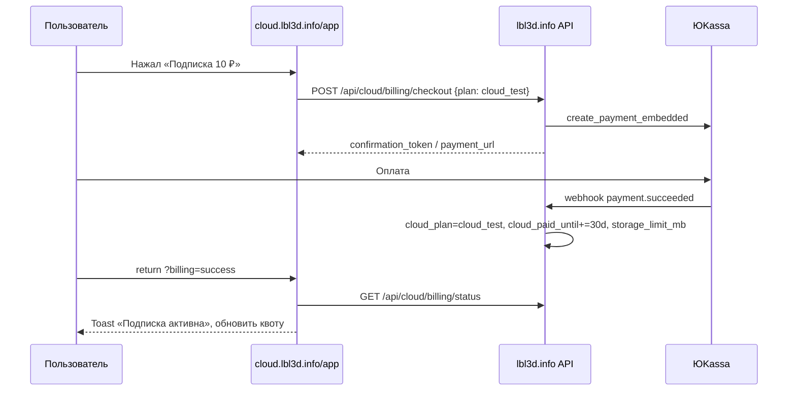
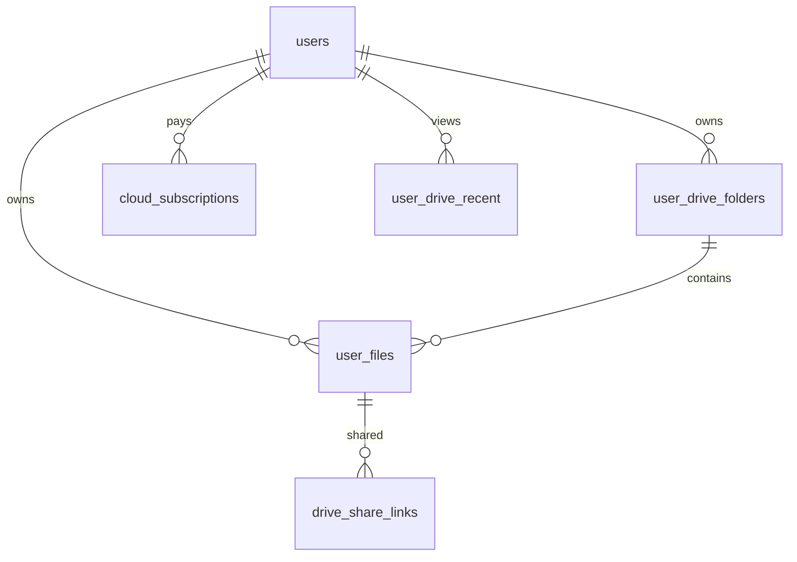

# ТЗ (полная версия): LBL Cloud — личный кабинет, лендинг, биллинг

**Версия документа:** 2.0 (максимально развёрнутая)  
**Продукт:** LBL Cloud — **автономное** облачное хранилище (отдельный продукт, не «раздел студии»)  
**Публичный URL:** [https://cloud.lbl3d.info](https://cloud.lbl3d.info)  
**Приложение:** [https://cloud.lbl3d.info/app/](https://cloud.lbl3d.info/app/)  
**Технический бэкенд:** общий API LBL (lbl3d.info / uvicorn) — **скрыт от пользователя**  
**Стек:** FastAPI + PostgreSQL + nginx + vanilla JS/CSS (без React в `/app/`)

> **Принцип автономности:** пользователь не должен чувствовать, что его ведут на «сайт студии». Все URL, тексты, шапки, футеры, вход и документы — в зоне `cloud.lbl3d.info`. Связь со студией — только опционально (P3), без CTA в шапке.

---

## Оглавление

1. [Резюме и цели](#1-резюме-и-цели)

1A. [Автономность продукта (обязательно)](#1a-автономность-продукта-обязательно)
2. [Роли пользователей](#2-роли-пользователей)
3. [Аудит текущего состояния](#3-аудит-текущего-состояния)
4. [Конкурентный уровень и позиционирование](#4-конкурентный-уровень-и-позиционирование)
5. [Дизайн-система и визуал](#5-дизайн-система-и-визуал)
6. [Информационная архитектура `/app/](#6-информационная-архитектура-app)`
7. [Функциональные модули (полный перечень)](#7-функциональные-модули-полный-перечень)
8. [Детализация по экранам и компонентам](#8-детализация-по-экранам-и-компонентам)
9. [Файловые операции (ядро диска)](#9-файловые-операции-ядро-диска)
10. [Загрузка и скачивание](#10-загрузка-и-скачивание)
11. [Превью и просмотр контента](#11-превью-и-просмотр-контента)
12. [Поиск, фильтры, сортировка](#12-поиск-фильтры-сортировка)
13. [Избранное, недавние, умные папки](#13-избранное-недавние-умные-папки)
14. [Корзина и версии файлов](#14-корзина-и-версии-файлов)
15. [Общий доступ и ссылки](#15-общий-доступ-и-ссылки)
16. [Командная работа (Team)](#16-командная-работа-team)
17. [Уведомления и активность](#17-уведомления-и-активность)
18. [Настройки и профиль](#18-настройки-и-профиль)
19. [Безопасность и приватность](#19-безопасность-и-приватность)
20. [Тарифы, подписка 10 ₽, биллинг](#20-тарифы-подписка-10--биллинг)
21. [Интеграция с LBL Studio](#21-интеграция-с-lbl-studio)
22. [Мобильная версия и PWA](#22-мобильная-версия-и-pwa)
23. [Десктоп-клиент и синхронизация (перспектива)](#23-десктоп-клиент-и-синхронизация-перспектива)
24. [Публичный API и вебхуки (перспектива)](#24-публичный-api-и-вебхуки-перспектива)
25. [Админка и оператор](#25-админка-и-оператор)
26. [Аналитика и метрики](#26-аналитика-и-метрики)
27. [Производительность и SLO](#27-производительность-и-slo)
28. [Юридическое и соответствие](#28-юридическое-и-соответствие)
29. [Модель данных (БД)](#29-модель-данных-бд)
30. [API (полный реестр)](#30-api-полный-реестр)
31. [Инфраструктура и деплой](#31-инфраструктура-и-деплой)
32. [Тестирование и приёмка](#32-тестирование-и-приёмка)
33. [Дорожная карта по фазам](#33-дорожная-карта-по-фазам)
34. [Риски и зависимости](#34-риски-и-зависимости)
35. [Что нужно от заказчика](#35-что-нужно-от-заказчика)

---

## 1. Резюме и цели

### 1.1. Бизнес-цель

Создать **полноценное автономное облачное хранилище** уровня «личный Google Drive / Яндекс.Диск»:

- **самостоятельный продукт** LBL Cloud на отдельном домене (не витрина студии);
- удерживает через удобство, скорость и доверие;
- монетизируется подписками (в т.ч. **тестовая 10 ₽/мес**);
- опциональная связь со студией — **без навязчивых ссылок** в UI.

### 1.2. Продуктовые KPI (целевые)


| KPI                                    | Цель (6 мес.)                 |
| -------------------------------------- | ----------------------------- |
| Конверсия лендинг → регистрация        | ≥ 8%                          |
| Активация (загрузил ≥1 файл за 7 дней) | ≥ 40% от зарегистрированных   |
| Платящие (любой тариф)                 | ≥ 5% MAU                      |
| Средняя скорость загрузки (p95)        | ≥ 50 МБ/с на канале 100+ Мбит |
| Uptime API `/api/drive`                | ≥ 99.9%                       |
| NPS (опрос в настройках)               | ≥ 40                          |


### 1.3. Критерии «идеально» для `/app/`

1. Визуально — **продолжение лендинга** (фото неба, glass, те же шрифты и акценты).
2. Функционально — **все заявленные на лендинге фичи работают**, не только текст.
3. Плашка «Ваше облако в безопасности» — облако **не обрезано**, сдвинуто как в макете.
4. Оплата **10 ₽** (и Pro/Team) — через ЮKassa основного сайта, лимит обновляется автоматически.
5. Без `?demo=1` в продакшене — только реальные данные пользователя.
6. **Автономность:** в `/app/` и на лендинге нет chip «Студия», нет ссылок «на lbl3d.info» в шапке; юридические страницы на `cloud.lbl3d.info`.

---

## 1A. Автономность продукта (обязательно)

### 1A.1. Что видит пользователь


| Зона         | Домен                                                  | Брендинг              |
| ------------ | ------------------------------------------------------ | --------------------- |
| Лендинг      | cloud.lbl3d.info                                       | LBL Cloud             |
| Диск `/app/` | cloud.lbl3d.info                                       | LBL Cloud             |
| Вход         | cloud.lbl3d.info/pages/auth/login                      | Экран LBL Cloud → SSO |
| Тарифы / FAQ | cloud.lbl3d.info/#pricing                              | LBL Cloud             |
| Политики     | cloud.lbl3d.info/pages/legal/                          | LBL Cloud             |
| Поддержка    | mailto:[support@lbl3d.help](mailto:support@lbl3d.help) | LBL Cloud             |


**Запрещено в основном UI (P0):**

- кнопка/чип «LBL Studio» / «Студия» в шапке `/app/`;
- ссылки «О нас», «Блог», «Карьера» на lbl3d.info в футере cloud;
- текст «Новинка экосистемы LBL», «перейдите в студию»;
- профиль, ведущий на lbl3d.info/pages/profile (→ настройки в `/app/#/settings`);
- меню «Приложения LBL» с пунктами студии.

**Допустимо (мелким шрифтом, P2):**

- строка в футере: «Сервис группы LBL» без ссылки;
- опциональный пункт «LBL Studio» в меню «Ещё» (не в шапке).

### 1A.2. Что остаётся технически общим (невидимо)


| Функция           | Где выполняется       | Как скрыть                                                 |
| ----------------- | --------------------- | ---------------------------------------------------------- |
| SSO / регистрация | lbl3d.info (редирект) | Брендированная страница `/pages/auth/login` на cloud       |
| API               | тот же uvicorn        | `Host: cloud.lbl3d.info`, cookie `.lbl3d.info`             |
| ЮKassa            | API lbl3d.info        | Страница оплаты `cloud.lbl3d.info/pages/billing/` (фаза 2) |
| Аккаунт в БД      | таблица `users`       | Единый user_id, в UI — «аккаунт LBL Cloud»                 |


### 1A.3. Уровни автономности (дорожная карта)


| Уровень        | Описание                                                  | Статус       |
| -------------- | --------------------------------------------------------- | ------------ |
| **L1 UX**      | Нет ссылок на студию, свой футер, legal, вход с cloud URL | ✅ внедряется |
| **L2 Auth**    | Форма входа/регистрации на cloud (iframe или proxy API)   | P2           |
| **L3 Billing** | Оплата и чеки только на cloud                             | P2           |
| **L4 Brand**   | Отдельный support@cloud, отдельные оферты                 | P3           |
| **L5 Infra**   | Отдельный API-хост api.cloud.lbl3d.info                   | P3           |


### 1A.4. Копирайт (замены)


| Было                             | Стало                                               |
| -------------------------------- | --------------------------------------------------- |
| Новинка экосистемы LBL           | Облако для ваших файлов                             |
| Один вход LBL, отдельный сервис  | Отдельный сервис LBL Cloud                          |
| Ссылка на file.lbl3d.info в hero | Убрать или «Быстрая отправка» без акцента на студию |
| LBL Studio в шапке app           | Убрано                                              |
| Профиль → lbl3d.info             | Настройки в `/app/`                                 |


### 1A.5. Файлы автономности


| Файл                                   | Изменение                             |
| -------------------------------------- | ------------------------------------- |
| `frontend/cloud/index.html`            | Футер, hero, login URL                |
| `frontend/cloud/landing.js`            | LOGIN = `/pages/auth/login`           |
| `frontend/pages/file/app/index.html`   | Без «Студия», профиль → settings      |
| `frontend/pages/file/js/lbl-drive.js`  | `cloudAuthLoginUrl()`                 |
| `frontend/cloud/pages/auth/login.html` | Бренд LBL Cloud                       |
| `frontend/cloud/pages/legal/*.html`    | Политики на cloud                     |
| `backend/nginx-lbl3d-cloud.conf`       | alias `/pages/auth/`, `/pages/legal/` |


### 1A.6. Критерии приёмки автономности

- На лендинге и в `/app/` нет видимых ссылок на lbl3d.info в шапке и основном контенте.
- «Войти» ведёт на `cloud.lbl3d.info/pages/auth/login`.
- Политика и оферта открываются на `cloud.lbl3d.info/pages/legal/`.
- Профиль открывает настройки облака, не сайт студии.
- Пользователь после входа возвращается на `cloud.lbl3d.info/app/`.

---

## 2. Роли пользователей


| Роль                   | Описание                    | Доступ                                  |
| ---------------------- | --------------------------- | --------------------------------------- |
| **Гость**              | Не авторизован              | Лендинг, CTA «Войти», редирект на login |
| **Пользователь Free**  | Аккаунт LBL, 5 ГБ           | Полный диск в лимите, базовые фичи      |
| **Пользователь Pro**   | Оплаченный тариф            | 200 ГБ+, приоритет, без рекламы         |
| **Пользователь Team**  | Командный тариф             | Общие папки, роли, 2 ТБ                 |
| **Участник по ссылке** | Внешний гость по share-link | Только просмотр/скачивание по правам    |
| **Оператор LBL**       | Админ-панель                | Статистика, лимиты, блокировки          |
| **Система**            | Webhook ЮKassa, cron        | Продление подписок, очистка корзины     |


---

## 3. Аудит текущего состояния

### 3.1. Реализовано в коде


| Компонент          | Путь                                          | Статус                                            |
| ------------------ | --------------------------------------------- | ------------------------------------------------- |
| Лендинг            | `frontend/cloud/index.html`, `landing.css`    | ✅ богатый UI                                      |
| Приложение `/app/` | `frontend/pages/file/app/index.html`          | ✅ каркас v11                                      |
| Стили              | `lbl-drive.css`                               | ✅ glass, тёмная тема                              |
| Логика             | `lbl-drive.js`, `lbl-drive-upload.js`         | ✅ browse, upload, UI                              |
| API диска          | `backend/lbl_drive.py`                        | ✅ browse, folders, upload chunk, download, delete |
| Схема папок        | `user_drive_folders`, `user_files.folder_id`  | ✅                                                 |
| Лимит              | `cloud_storage_limit_mb`, `LBL_CLOUD_FREE_MB` | ✅ min 5 ГБ                                        |
| Auth               | cookie `.lbl3d.info`, Bearer                  | ✅                                                 |
| ЮKassa (депозит)   | `main.py`, `yookassa_client.py`               | ✅ на lbl3d.info                                   |
| Nginx cloud        | `nginx-lbl3d-cloud.conf`                      | ✅                                                 |


### 3.2. Частично / заглушки


| Фича                                     | Проблема                              |
| ---------------------------------------- | ------------------------------------- |
| Недавние, Избранное, Поделились, Корзина | UI есть; API нет (демо при `?demo=1`) |
| Inspector, selection bar                 | UI есть; share/favorite не на API     |
| Настройки                                | Секция = фейковые «папки» в demo      |
| Уведомления (колокол)                    | Кнопка без логики                     |
| «Приложения» (grip)                      | Кнопка без меню                       |
| Превью фото/видео/3D                     | Нет endpoint `/preview` (был откат)   |
| Биллинг в `/app/`                        | Нет                                   |
| Плашка безопасности                      | PNG 404, облако за блоком             |
| Фон `/app/`                              | CSS, не `cloudscape-hero.png`         |
| Тарифы лендинга                          | 299/799 ₽ — не связаны с БД           |


### 3.3. Критические баги продакшена

1. **404 ассетов:** `drive-security-cloud.png`, `cloudscape-hero.png`, шрифты woff2.
2. **401 без логина** — нет красивого onboarding-экрана.
3. **Жёсткое удаление** файлов — нет корзины на бэкенде.
4. **Нет move** файла между папками через UI (API `FileMoveBody` есть в модели, роут проверить).

---

## 4. Конкурентный уровень и позиционирование

### 4.1. С кем сравниваем (лендинг `#compare`)


| Возможность             | LBL Cloud (цель)                  | Типичный конкурент |
| ----------------------- | --------------------------------- | ------------------ |
| Личный диск             | ✅ неограниченно по файлам в квоте | Ограниченно        |
| Загрузка крупных файлов | до **1 ГБ** на файл               | 100–250 МБ         |
| Скорость                | заявка **120 МБ/с**               | 10–30 МБ/с         |
| Шифрование              | AES-256 at rest + TLS             | Не всегда          |
| Реклама                 | нет в `/app/`                     | есть               |
| 3D / STL превью         | ✅ (уникально для LBL)             | редко              |
| Связь со студией        | рендеры, проекты                  | нет                |


### 4.2. Уникальные фишки LBL Cloud (обязательно в ТЗ)

1. **Автономный продукт** — отдельный домен и UX без «ведения в студию».
2. **Превью 3D** (STL/OBJ/GLB) в браузере — опционально «Открыть в студии» (P3, не в шапке).
3. **Тестовая подписка 10 ₽** — низкий порог входа в оплату.
4. **Плашка безопасности** с метриками AES / uptime / скорость.
5. **Импорт из студии** (P3) — только по явному действию пользователя в студии, не из облака.

---

## 5. Дизайн-система и визуал

### 5.1. Токены (синхрон с лендингом)

```css
/* Обязательные CSS-переменные в .lbl-drive-app */
--lc-primary: #6366f1;
--lc-primary-deep: #4f46e5;
--lc-cyan: #45c9ff;
--lc-mint: #24d49a;
--lc-rose: #f6a4ff;
--lc-bg: #edf3ff;
--lc-glass: rgba(255, 255, 255, 0.72);
--lc-blur: 22px;
--lc-radius-lg: 20px;
--lc-radius-md: 14px;
--lc-shadow: 0 22px 70px rgba(62, 74, 178, 0.14);
--lc-font-display: "Montserrat", sans-serif;
--lc-font-body: "Roboto", system-ui, sans-serif;
```

### 5.2. Фон страницы `/app/` (обязательно)

**Требование:** как блок `.cloudscape` на лендинге — **фотография неба с облаками**.


| Слой            | z-index | Описание                                                       |
| --------------- | ------- | -------------------------------------------------------------- |
| `ld-bg__photo`  | 0       | `url("/cloud/assets/cloudscape-hero.png")` cover, `center 20%` |
| `ld-bg__aurora` | 1       | Градиенты фиолет/голубой, opacity 0.65                         |
| `ld-bg__mesh`   | 2       | Тонкая сетка (как landing kinetic)                             |
| `ld-bg__clouds` | 3       | Опционально CSS-облака поверх (parallax)                       |
| `ld-bg__glass`  | 4       | Размытые «стеклянные» пятна                                    |
| `ld-bg__stars`  | 5       | Только в `data-theme="dark"`                                   |


**Parallax:** при скролле основной панели фон смещается на 3–8% (`transform: translateY` от scrollY).

**Reduced motion:** `@media (prefers-reduced-motion: reduce)` — статичное фото.

### 5.3. Плашка «Ваше облако в безопасности»

**Текущий баг:** `.ld-security-cloud img` width 320–382px, родитель 210–260px, `overflow: hidden` на `.ld-security-card`.

**Требуемое решение:**

```css
.ld-security-card {
  overflow: visible; /* desktop */
}
.ld-security-cloud {
  position: relative;
  width: min(280px, 28vw);
  height: 140px;
  justify-self: end;
  margin-right: -24px; /* визуальный вынос вправо, но облако сдвинуть ВЛЕВО внутри */
}
.ld-security-cloud img {
  width: 100%;
  max-width: 420px;
  object-fit: contain;
  object-position: left center; /* ключ: левее, не уезжает за правый край */
  transform: translateX(-12%);
}
```

**Breakpoints:**

- `≥ 1280px` — 4 колонки: иконка | текст | stats | облако.
- `768–1279px` — stats в 3 колонки под текстом, облако справа от текста, `max-height: 120px`.
- `< 768px` — облако **под** stats, по центру, `transform: none`, `max-width: 90%`.

**Ассет:** `frontend/assets/cloud/drive-security-cloud.png` (520×280, прозрачный PNG).

**Ссылка «Подробнее»:** `https://cloud.lbl3d.info/#compare` или якорь безопасности на лендинге.

### 5.4. Типографика


| Элемент        | Шрифт      | Размер  | Вес     |
| -------------- | ---------- | ------- | ------- |
| H1 command     | Montserrat | 28–32px | 800     |
| H2 секции      | Montserrat | 20–24px | 700     |
| Body           | Roboto     | 14–15px | 400–500 |
| Мета / подписи | Roboto     | 11–13px | 600     |
| Кнопки CTA     | Montserrat | 14px    | 700     |


### 5.5. Компоненты UI (библиотека)


| Компонент        | Класс               | Состояния                                 |
| ---------------- | ------------------- | ----------------------------------------- |
| Primary button   | `.ld-btn--primary`  | default, hover, active, disabled, loading |
| Soft button      | `.ld-btn--soft`     | —                                         |
| Icon button      | `.ld-icon-btn`      | + badge для уведомлений                   |
| Chip (nav)       | `.ld-chip`          | active, hover                             |
| Glass panel      | `.ld-panel`         | nav, main, uploads                        |
| File card        | `.ld-file`          | hover, selected, uploading, error         |
| Modal            | `.ld-modal`         | focus trap, Esc закрывает                 |
| Toast            | `.ld-toast`         | success, error, info, 4s auto-hide        |
| Context menu     | `.ld-ctx`           | позиция у курсора, не выходит за viewport |
| Dropzone overlay | `.ld-dropzone`      | drag-enter анимация                       |
| Quota ring       | `.ld-quota`         | цвет: green <70%, amber 70–90%, red >90%  |
| Progress upload  | `.ld-upload-item`   | %, МБ, МБ/с, пауза, отмена                |
| Skeleton         | `.ld-skeleton`      | при загрузке grid                         |
| Empty state      | `.ld-state--empty`  | иллюстрация + 2 CTA                       |
| Security card    | `.ld-security-card` | см. 5.3                                   |


### 5.6. Тёмная тема

- Переключатель в шапке, ключ `localStorage.theme`.
- Фон: фото + overlay `#09111f` 55%.
- Glass: `rgba(15, 23, 42, 0.76)`.
- Контраст текста WCAG AA минимум.
- Иконки SVG stroke `currentColor`.

### 5.7. Микроанимации


| Действие                | Анимация                      |
| ----------------------- | ----------------------------- |
| Открытие папки          | fade + slide 120ms            |
| Появление файлов в grid | stagger 30ms                  |
| Загрузка завершена      | pulse на карточке             |
| Drag over dropzone      | scale 1.02 dropzone card      |
| Command orbit           | медленное вращение 40s linear |
| Hover file card         | translateY(-2px), shadow      |


### 5.8. Ассеты (полный список)


| Файл                       | Назначение             | Путь URL           |
| -------------------------- | ---------------------- | ------------------ |
| `cloudscape-hero.png`      | Фон app + hero лендинг | `/cloud/assets/`   |
| `detail-wide-scene.png`    | Лендинг detail         | `/cloud/assets/`   |
| `testimonial-avatars.png`  | Отзывы                 | `/cloud/assets/`   |
| `drive-security-cloud.png` | Плашка безопасности    | `/assets/cloud/`   |
| `drive-icon-shield.png`    | Иконка щита (опц.)     | `/assets/cloud/`   |
| `lbl-cloud-mark.svg`       | Логотип                | `/assets/cloud/`   |
| favicon set                | Вкладка                | `/assets/favicon/` |
| thumb-placeholder.svg      | Нет превью             | `/assets/cloud/`   |


---

## 6. Информационная архитектура `/app/`

### 6.1. Карта разделов

```mermaid
flowchart TB
    subgraph topbar [Шапка]
        Brand[LBL Cloud]
        NavChips[Файлы | Поделились | Корзина | Настройки]
        Search[Глобальный поиск]
        UploadBtn[Загрузить]
        Notif[Уведомления]
        Apps[Приложения LBL]
        Theme[Тема]
        Profile[Профиль]
    end
    subgraph sidebar [Сайдбар]
        Drive[Мой диск]
        Recent[Недавние]
        Fav[Избранное]
        Shared[Поделились]
        Trash[Корзина]
        Quota[Квота + тариф]
        Quick[Загрузить | Папка]
    end
    subgraph main [Контент]
        Command[Command hero]
        Path[Breadcrumbs]
        Filters[Фильтры типов]
        Grid[Сетка / список]
        Security[Плашка безопасности]
    end
    subgraph overlays [Оверлеи]
        Inspector[Inspector]
        Uploads[Панель загрузок]
        Modals[Модалки]
        Ctx[Контекстное меню]
    end
    topbar --> main
    sidebar --> main
    main --> overlays
```


### 6.2. URL и навигация


| Раздел       | URL (рекомендация)         | `data-section` |
| ------------ | -------------------------- | -------------- |
| Мой диск     | `/app/` или `/app/#/drive` | `drive`        |
| Папка        | `/app/#/folder/{id}`       | `drive`        |
| Недавние     | `/app/#/recent`            | `recent`       |
| Избранное    | `/app/#/favorites`         | `favorites`    |
| Поделились   | `/app/#/shared`            | `shared`       |
| Корзина      | `/app/#/trash`             | `trash`        |
| Настройки    | `/app/#/settings`          | `settings`     |
| Оплата успех | `/app/?billing=success`    | —              |


**Deep link:** открытие файла `?file={id}&preview=1`.

---

## 7. Функциональные модули (полный перечень)

Ниже — **все фишки**, которые должны быть заложены в продукт (с приоритетом).

**Легенда приоритетов:** P0 — без этого нельзя в прод; P1 — MVP+; P2 — важно для «идеально»; P3 — перспектива.

### 7.1. Аутентификация и сессии (P0)


| ID  | Фича             | Описание                                    |
| --- | ---------------- | ------------------------------------------- |
| A1  | SSO с lbl3d.info | Cookie domain `.lbl3d.info`                 |
| A2  | Return URL       | После логина → `/app/`                      |
| A3  | Bearer для API   | `Authorization` из cookie/localStorage      |
| A4  | Экран «Войдите»  | Если 401 — карточка с CTA, не красный текст |
| A5  | Выход            | Очистка токена, редирект                    |
| A6  | Сессии (P2)      | Список устройств в настройках               |


### 7.2. Файловый менеджер (P0–P1)


| ID  | Фича                          | Приоритет |
| --- | ----------------------------- | --------- |
| F1  | Просмотр папок                | P0        |
| F2  | Breadcrumbs                   | P0        |
| F3  | Создание папки                | P0        |
| F4  | Переименование файл/папка     | P0        |
| F5  | Удаление → корзина            | P1        |
| F6  | Перемещение drag&drop         | P1        |
| F7  | Копирование                   | P2        |
| F8  | Множественный выбор           | P1        |
| F9  | Массовое удаление/скачивание  | P1        |
| F10 | Контекстное меню ПКМ          | P1        |
| F11 | Двойной клик — открыть/превью | P1        |
| F12 | Grid / List view              | P0        |
| F13 | Сортировка 4 типа             | P0        |
| F14 | Фильтры по типу               | P0        |
| F15 | Пустое состояние + CTA        | P0        |
| F16 | Drag-and-drop загрузка        | P0        |
| F17 | Загрузка в текущую папку      | P0        |
| F18 | Иконки по типу файла          | P0        |
| F19 | Drag reorder (P3)             | P3        |


### 7.3. Загрузка / скачивание (P0–P1)


| ID  | Фича                                | Приоритет |
| --- | ----------------------------------- | --------- |
| U1  | Простая загрузка (< порога)         | P0        |
| U2  | Chunked upload (8 МБ чанки)         | P0        |
| U3  | Resume после обрыва (P2)            | P2        |
| U4  | Параллельные чанки (P2)             | P2        |
| U5  | Прогресс % + МБ + скорость          | P1        |
| U6  | Панель загрузок справа              | P0        |
| U7  | FAB «загрузки» при свёрнутой панели | P0        |
| U8  | Отмена загрузки                     | P1        |
| U9  | Пауза (P2)                          | P2        |
| U10 | Очередь нескольких файлов           | P1        |
| U11 | Проверка квоты до старта            | P0        |
| U12 | Проверка max 1 ГБ на файл           | P0        |
| U13 | Скачивание одного файла             | P0        |
| U14 | ZIP нескольких (P2)                 | P2        |
| U15 | Прямая ссылка download с token TTL  | P1        |


### 7.4. Превью и просмотр (P1–P2)


| ID  | Фича                      | Типы                 |
| --- | ------------------------- | -------------------- |
| P1  | Inline превью в inspector | jpg, png, webp, gif  |
| P2  | Lightbox полноэкран       | изображения          |
| P3  | Video player              | mp4, webm            |
| P4  | Audio player              | mp3, wav, ogg        |
| P5  | PDF viewer                | pdf (pdf.js)         |
| P6  | Текстовый просмотр        | txt, md, json (P2)   |
| P7  | 3D viewer Three.js        | stl, obj, glb        |
| P8  | Office preview (P3)       | docx через конвертер |
| P9  | Thumbnails grid           | lazy load + cache    |
| P10 | EXIF / метаданные (P2)    | фото                 |


### 7.5. Организация и поиск (P1–P2)


| ID  | Фича                                       |
| --- | ------------------------------------------ |
| S1  | Поиск по имени в папке                     |
| S2  | Глобальный поиск по всему диску            |
| S3  | Поиск по содержимому PDF (P3)              |
| S4  | Недавние файлы (20–50)                     |
| S5  | Избранное ★                                |
| S6  | Цветные метки папок (P2)                   |
| S7  | Теги файлов (P3)                           |
| S8  | Умные папки: «Большие файлы», «Видео» (P2) |
| S9  | Дубликаты finder (P3)                      |


### 7.6. Корзина и версии (P1–P2)


| ID  | Фича                             |
| --- | -------------------------------- |
| T1  | Soft delete `deleted_at`         |
| T2  | Восстановление из корзины        |
| T3  | Очистить корзину                 |
| T4  | Автоочистка 30 дней (cron)       |
| T5  | Версии файла при перезаписи (P2) |
| T6  | История изменений папки (P3)     |


### 7.7. Шаринг (P1–P2)


| ID  | Фича                                       |
| --- | ------------------------------------------ |
| H1  | Публичная ссылка на файл                   |
| H2  | Ссылка на папку                            |
| H3  | Срок действия ссылки                       |
| H4  | Пароль на ссылку                           |
| H5  | Права: просмотр / скачивание / загрузка    |
| H6  | Страница гостя `/s/{token}`                |
| H7  | QR-код ссылки (P2)                         |
| H8  | Отзыв ссылки                               |
| H9  | Статистика переходов (P2)                  |
| H10 | Внутренний шаринг с пользователем LBL (P2) |


### 7.8. Командная работа Team (P2–P3)


| ID  | Фича                        |
| --- | --------------------------- |
| C1  | Workspace команды           |
| C2  | Общие папки                 |
| C3  | Роли: owner, editor, viewer |
| C4  | Комментарий к файлу (P3)    |
| C5  | Activity feed команды       |
| C6  | Приглашение по email        |


### 7.9. Уведомления (P1–P2)


| ID  | Фича                          |
| --- | ----------------------------- |
| N1  | Колокол: список событий       |
| N2  | Загрузка завершена            |
| N3  | Квота 80% / 95%               |
| N4  | Новый файл в общей папке      |
| N5  | Подписка истекает через 3 дня |
| N6  | Email digest (P3)             |
| N7  | Push PWA (P3)                 |


### 7.10. Настройки (P1)


| ID   | Фича                                                    |
| ---- | ------------------------------------------------------- |
| SET1 | Профиль (readonly, данные из API; без ссылки на студию) |
| SET2 | Тариф и оплата                                          |
| SET3 | Тема и вид по умолчанию                                 |
| SET4 | Язык RU/EN (P2)                                         |
| SET5 | Миниатюры вкл/выкл                                      |
| SET6 | Автозагрузка фото с телефона (P3)                       |
| SET7 | Экспорт всех данных GDPR                                |
| SET8 | Удаление аккаунта (запрос)                              |


### 7.11. Биллинг (P0–P1)


| ID  | Фича                     |
| --- | ------------------------ |
| B1  | Тариф Free 5 ГБ          |
| B2  | Тариф Test **10 ₽/мес**  |
| B3  | Тариф Pro 200 ГБ (299 ₽) |
| B4  | Тариф Team 2 ТБ (799 ₽)  |
| B5  | Годовая оплата −30%      |
| B6  | Промокоды (P2)           |
| B7  | Автопродление            |
| B8  | Счёт-оферта в PDF (P3)   |
| B9  | История платежей         |
| B10 | Апгрейд/даунгрейд        |


### 7.12. Безопасность (P1–P2)


| ID    | Фича                                     |
| ----- | ---------------------------------------- |
| SEC1  | HTTPS only                               |
| SEC2  | TLS 1.2+                                 |
| SEC3  | Шифрование at rest (диск сервера / LUKS) |
| SEC4  | Изоляция `user_id` в путях               |
| SEC5  | Валидация MIME + magic bytes             |
| SEC6  | Антивирус ClamAV (P2)                    |
| SEC7  | Rate limit API                           |
| SEC8  | 2FA наследуется от LBL                   |
| SEC9  | Audit log действий                       |
| SEC10 | Блокировка IP при brute (P2)             |


### 7.13. Интеграции LBL Studio (P3 — опционально, не в основном UX)

> **Не продвигать студию из облака.** Интеграция односторонняя: из студии → в облако.


| ID  | Фича                                           | Приоритет |
| --- | ---------------------------------------------- | --------- |
| I1  | «Сохранить в LBL Cloud» в студии               | P3        |
| I2  | Picker файлов из облака в студии               | P3        |
| I3  | Deep link `lblstudio://`                       | P3        |
| I4  | ~~Папка «Проекты LBL»~~ → нейтральная «Импорт» | P3        |
| I5  | Webhook backup                                 | P3        |


### 7.14. Мобильное и PWA (P2)


| ID  | Фича                                 |
| --- | ------------------------------------ |
| M1  | Responsive layout                    |
| M2  | Touch: long press = контекстное меню |
| M3  | PWA manifest + icons                 |
| M4  | Offline список кэш (P3)              |
| M5  | Share target API (P3)                |


### 7.15. Админ и аналитика (P2–P3)


| ID  | Фича                               |
| --- | ---------------------------------- |
| AD1 | Dashboard: пользователи, ГБ, доход |
| AD2 | Поиск пользователя, лимит вручную  |
| AD3 | Блокировка загрузок                |
| AD4 | Логи ЮKassa                        |


---

## 8. Детализация по экранам и компонентам

### 8.1. Шапка (`.ld-topbar`)


| Элемент              | Поведение                                        |
| -------------------- | ------------------------------------------------ |
| Логотип              | Ссылка на лендинг cloud.lbl3d.info               |
| ~~Chip «Студия»~~    | **Убрано** (автономность)                        |
| Chip «Файлы»         | section=drive                                    |
| Chip «Поделились»    | section=shared                                   |
| Chip «Корзина»       | section=trash, badge с количеством               |
| Chip «Настройки»     | section=settings                                 |
| Поиск глобальный     | `driveSearchTop` → API `/drive/search?q=`        |
| «+»                  | Открыть file picker                              |
| Колокол              | Dropdown уведомлений                             |
| Тарифы (иконка gift) | Ссылка на `/#pricing` на cloud                   |
| Профиль              | `data-section=settings` в `/app/`, не lbl3d.info |
| Тема                 | toggle light/dark                                |
| Профиль              | Аватар из API user, имя                          |
| Войти                | Скрыт когда авторизован                          |


### 8.2. Command block (`.ld-command`)


| Поле                    | Источник данных                      |
| ----------------------- | ------------------------------------ |
| Заголовок               | Имя секции («Мой диск», «Недавние»…) |
| Подзаголовок            | Динамический: «12 папок, 48 файлов»  |
| Метрика «X ГБ доступно» | `limit - used` из API                |
| «120 МБ/с»              | Конфиг / реальная метрика CDN (P2)   |
| «Private»               | Иконка замка, tooltip                |


**Орбита** — декоративные круги, не блокируют клики.

### 8.3. Сайдбар


| Блок                      | Детали                                       |
| ------------------------- | -------------------------------------------- |
| Badge «5 ГБ бесплатно»    | Меняется на «Pro» / «Team» по тарифу         |
| Квота ring                | Цветовая индикация, клик → настройки → тариф |
| **Карточка тарифа (NEW)** | «Увеличить до 200 ГБ» / «10 ₽/мес тест»      |
| Быстрые кнопки            | Upload, New folder                           |


### 8.4. Сетка файлов (`.ld-file`)

**Карточка содержит:**

- превью (thumb или иконка типа);
- имя (truncate 2 строки);
- мета: размер + дата;
- badge: ★ избранное, 🔗 общий, 🆕 новый (<24ч);
- hover actions: скачать, ⋮ меню;
- checkbox corner при multi-select mode (P1).

**Список (list view):** колонки Имя | Владелец | Изменён | Размер | ⋮.

### 8.5. Selection bar

Действия: Ссылка | В избранное | Скачать | Переименовать | Удалить | Закрыть.  
При multi-select: «Выбрано N» + только Скачать ZIP, Удалить.

### 8.6. Inspector (правая панель)

- Превью 16:9 max 240px;
- Имя, тип, размер, даты created/modified;
- Владелец, доступ, активность;
- Кнопки: Ссылка, Скачать, Переименовать, В корзину;
- Блок «Расположение» — кликабельный breadcrumb.

### 8.7. Панель загрузок

Каждый item:

```
[icon] filename.ext
[=========>    ] 67%
12.4 / 18.4 МБ · 8.2 МБ/с
[пауза] [отмена]
```

Ошибка — красная полоса + «Повторить».

### 8.8. Модалки


| Модалка                | Поля                             |
| ---------------------- | -------------------------------- |
| Переименовать          | input, валидация символов        |
| Новая папка            | input                            |
| Создать ссылку         | срок, пароль, права              |
| Подтверждение удаления | «В корзину» / «Навсегда» (admin) |
| Оплата                 | embed ЮKassa или redirect        |
| О квоте                | при 95% — CTA тариф              |


### 8.9. Контекстное меню

Пункты для файла: Открыть | Скачать | Переименовать | Переместить | В избранное | Поделиться | Копировать ссылку | Удалить.  
Для папки: Открыть | Переименовать | Переместить | Поделиться | Удалить.

---

## 9. Файловые операции (ядро диска)

### 9.1. Правила имён

- Длина 1–255 символов;
- Запрещены `/ \ : * ? " < > |` и управляющие;
- Уникальность в пределах папки;
- Автопереименование при конфликте: `file (1).pdf` (P2).

### 9.2. Лимиты


| Параметр    | Free            | Pro        | Team       |
| ----------- | --------------- | ---------- | ---------- |
| Хранилище   | 5 ГБ            | 200 ГБ     | 2 ТБ       |
| Макс. файл  | 1 ГБ            | 1 ГБ       | 1 ГБ       |
| Папок       | без лимита      | без лимита | без лимита |
| Share links | 5 активных (P1) | 50         | 200        |


### 9.3. API уже есть — доработать

- `GET /api/drive/browse?folder_id=&q=`
- `POST /api/drive/folders`
- `PATCH /api/drive/folders/{id}`
- `DELETE /api/drive/folders/{id}` — каскад в корзину (P1)
- `POST /api/drive/upload`, `upload/init`, `chunk`, `complete`
- `PATCH /api/drive/files/{id}` — rename + **move folder_id**
- `DELETE /api/drive/files/{id}` — soft delete (P1)

### 9.4. Новые endpoints (ядро)


| Метод | Путь                              | Назначение                 |
| ----- | --------------------------------- | -------------------------- |
| POST  | `/api/drive/files/{id}/move`      | move to folder             |
| POST  | `/api/drive/files/batch/delete`   | массовое в корзину         |
| POST  | `/api/drive/files/batch/download` | zip stream                 |
| GET   | `/api/drive/search`               | глобальный поиск           |
| GET   | `/api/drive/stats`                | счётчики для command block |


---

## 10. Загрузка и скачивание

### 10.1. Алгоритм chunked (текущий)

1. `POST /upload/init` — `{ filename, size_bytes, folder_id }` → `upload_id`.
2. Цикл `POST /upload/chunk` — `upload_id`, `index`, binary.
3. `POST /upload/complete` — сборка, запись в `user_files`.

### 10.2. UX требования

- Старт загрузки < 300 ms после выбора файла;
- UI не блокируется;
- При ошибке сети — 3 retry с exponential backoff;
- Дубликат имени — модалка «Заменить / Оба / Отмена» (P2).

### 10.3. Оптимизации (P2)

- Параллельно 3–4 чанка;
- Увеличение чанка до 16–32 МБ на быстром канале;
- Сжатие только для текстовых (не для zip/jpg).

### 10.4. Скачивание

- `Content-Disposition: attachment`;
- Имя файла UTF-8 RFC 5987;
- Range requests для видео (P2);
- Token в query `?token=` для `` и превью.

---

## 11. Превью и просмотр контента

### 11.1. Endpoint

```
GET /api/drive/files/{id}/preview?token=...
```

- Проверка владельца или валидного share-token;
- `Content-Type` по расширению;
- Cache-Control: private, max-age=3600;
- Для больших видео — redirect на signed URL (P2).

### 11.2. 3D viewer (LBL-уникальное)

- Библиотека: Three.js (vendor);
- Форматы: STL (binary/ascii), OBJ, GLB;
- Controls: orbit, zoom, grid, освещение;
- Кнопка «Открыть в LBL Studio» (deep link);
- Fallback: «Скачать» если формат не поддержан.

### 11.3. Lightbox

- Полноэкран поверх app;
- Стрелки prev/next в папке для изображений;
- Esc закрывает;
- Swipe на мобильном.

---

## 12. Поиск, фильтры, сортировка

### 12.1. Поиск

- Debounce 350 ms (уже есть);
- Минимум 2 символа;
- Подсветка совпадений в имени;
- Результаты: файлы + папки, группировка;
- «Ничего не найдено» + сброс.

### 12.2. Фильтры (уже в UI)

`all | folder | file | image | document | video | archive` — серверная фильтрация `mime`/`ext` (P1).

### 12.3. Расширенный фильтр (P2)

Модалка: размер от–до, дата, только избранное, только shared.

---

## 13. Избранное, недавние, умные папки

### 13.1. Избранное

- Поля: `user_files.is_favorite`, `user_drive_folders.is_favorite`;
- Toggle: selection bar, контекстное меню, inspector;
- API: `PATCH /files/{id} { is_favorite: true }`.

### 13.2. Недавние

Таблица `user_drive_recent`:

```sql
user_id, file_id, folder_id, action ENUM('open','download','upload'), at TIMESTAMP
```

- При открытии/скачивании — upsert;
- `GET /api/drive/recent?limit=50`.

### 13.3. Умные папки (P2)

Виртуальные разделы без дублирования файлов:

- «Большие» — size > 100 МБ;
- «Видео» — mime video/*;
- «Скриншоты» — имя содержит screenshot (P3).

---

## 14. Корзина и версии файлов

### 14.1. Soft delete

```sql
ALTER TABLE user_files ADD COLUMN deleted_at TIMESTAMP;
ALTER TABLE user_drive_folders ADD COLUMN deleted_at TIMESTAMP;
```

- DELETE API → set `deleted_at = now()`;
- browse по умолчанию `deleted_at IS NULL`;
- `/trash` → только удалённые.

### 14.2. Восстановление

- `POST /api/drive/trash/{id}/restore`;
- Конфликт имени — автопереименование.

### 14.3. Очистка

- Пользователь: «Очистить корзину»;
- Cron: удаление файлов с диска старше 30 дней в корзине.

### 14.4. Версии (P2)

Таблица `user_file_versions` — при замене файла сохранять старую версию (лимит 5 версий / файл для Pro).

---

## 15. Общий доступ и ссылки

### 15.1. Модель

```sql
CREATE TABLE drive_share_links (
  id SERIAL PRIMARY KEY,
  user_id INT REFERENCES users(id),
  resource_type VARCHAR(10), -- file | folder
  resource_id INT NOT NULL,
  token VARCHAR(64) UNIQUE,
  password_hash VARCHAR(255),
  permission VARCHAR(20), -- view | download | edit
  expires_at TIMESTAMP,
  view_count INT DEFAULT 0,
  created_at TIMESTAMP DEFAULT NOW(),
  revoked_at TIMESTAMP
);
```

### 15.2. Публичная страница

- URL: `https://cloud.lbl3d.info/s/{token}`;
- Брендинг LBL, список файлов папки, скачивание;
- Пароль — форма при необходимости;
- Без авторизации для view/download.

### 15.3. UI в `/app/`

Модалка «Поделиться»:

- Переключатель: «Только вы» / «По ссылке» / «С пользователем LBL»;
- Copy link + «Скопировано» toast;
- QR (P2);
- Срок: 1 день / 7 / 30 / бессрочно;
- Пароль опционально.

---

## 16. Командная работа (Team)

### 16.1. Тариф Team

- До 10 участников (настраиваемо);
- 2 ТБ общий пул или на пользователя — **уточнить у заказчика**.

### 16.2. Workspace

```sql
CREATE TABLE drive_workspaces (
  id SERIAL PRIMARY KEY,
  name VARCHAR(120),
  owner_id INT REFERENCES users(id),
  storage_limit_mb BIGINT,
  plan VARCHAR(32) DEFAULT 'team'
);
CREATE TABLE drive_workspace_members (
  workspace_id INT, user_id INT, role VARCHAR(20), PRIMARY KEY(workspace_id, user_id)
);
```

### 16.3. UI

- Переключатель workspace в сайдбаре (P2);
- Папка «Общие» с аватарами участников;
- Уведомление при добавлении в workspace.

---

## 17. Уведомления и активность

### 17.1. In-app

Таблица `user_notifications`:

- `type`, `title`, `body`, `read_at`, `href`, `created_at`.

### 17.2. События


| Событие         | Текст                             |
| --------------- | --------------------------------- |
| upload_complete | «Загружен file.pdf»               |
| quota_80        | «Занято 80% хранилища»            |
| share_opened    | «Просмотр ссылки: Отчет.pdf» (P2) |
| billing_expire  | «Подписка истекает через 3 дня»   |


### 17.3. Журнал активности (inspector + settings)

- `drive_activity_log` — user_id, action, resource, ip, at;
- Показ последних 50 в настройках.

---

## 18. Настройки и профиль

### 18.1. Layout настроек

Вкладки (не список папок!):

1. **Общие** — тема, вид, язык;
2. **Хранилище** — квота, график роста (P2);
3. **Подписка** — тариф, оплата, история;
4. **Безопасность** — ссылки на 2FA, сессии;
5. **Уведомления** — чекбоксы типов;
6. **О сервисе** — версия, политики.

### 18.2. Экран «Подписка»

- Текущий план, дата окончания;
- Кнопки: «10 ₽ тест», «Pro 299 ₽», «Team 799 ₽»;
- История: дата, сумма, статус, чек.

---

## 19. Безопасность и приватность

### 19.1. Плашка внизу списка (маркетинг + доверие)

Три метрики (уже в UI):

- Шифрование AES-256;
- Надёжность 99.99%;
- Скорость (согласовать текст с реальными SLO).

### 19.2. Технические меры


| Мера              | Реализация                              |
| ----------------- | --------------------------------------- |
| Изоляция файлов   | `/storage/drive/{user_id}/`             |
| AuthZ             | каждый запрос `user_id == current_user` |
| Share token       | crypto random 32+ bytes                 |
| Password share    | bcrypt                                  |
| Upload validation | `validate_upload` + размер              |
| CSP headers       | nginx для `/app/`                       |
| CORS              | только lbl3d.info, cloud.lbl3d.info     |


### 19.3. GDPR / 152-ФЗ

- Политика конфиденциальности — ссылка в footer;
- Экспорт данных по запросу (ZIP метаданных + файлов);
- Удаление аккаунта — тикет в поддержку, cron wipe через 30 дней.

---

## 20. Тарифы, подписка 10 ₽, биллинг

### 20.1. Матрица тарифов (единая для лендинга и `/app/`)


| Тариф    | ID           | Цена/мес | Год (−30%) | Хранилище | Max файл | Фишки                  |
| -------- | ------------ | -------- | ---------- | --------- | -------- | ---------------------- |
| Free     | `free`       | 0 ₽      | —          | 5 ГБ      | 1 ГБ     | база                   |
| **Test** | `cloud_test` | **10 ₽** | —          | 50 ГБ*    | 1 ГБ     | тест оплаты            |
| Pro      | `cloud_pro`  | 299 ₽    | 249 ₽      | 200 ГБ    | 1 ГБ     | приоритет, без рекламы |
| Team     | `cloud_team` | 799 ₽    | 669 ₽      | 2 ТБ      | 1 ГБ     | workspace, шаринг      |


 лимит Test — **уточнить у заказчика** (50 ГБ предложение для осмысленности).

### 20.2. Поток оплаты 10 ₽




### 20.3. Поля в `users`

```sql
cloud_plan VARCHAR(32) DEFAULT 'free',
cloud_paid_until TIMESTAMPTZ,
cloud_billing_period VARCHAR(10) DEFAULT 'month', -- month | year
```

### 20.4. Таблица подписок

```sql
CREATE TABLE cloud_subscriptions (
  id SERIAL PRIMARY KEY,
  user_id INTEGER NOT NULL REFERENCES users(id),
  plan_id VARCHAR(32) NOT NULL,
  amount_rub NUMERIC(10,2) NOT NULL,
  currency CHAR(3) DEFAULT 'RUB',
  yookassa_payment_id VARCHAR(255),
  status VARCHAR(32), -- pending | active | canceled | expired
  period_start TIMESTAMPTZ,
  period_end TIMESTAMPTZ,
  auto_renew BOOLEAN DEFAULT TRUE,
  created_at TIMESTAMPTZ DEFAULT NOW()
);
```

### 20.5. Webhook

Расширить обработчик ЮKassa:

```python
if metadata.get("product") == "cloud_subscription":
    apply_cloud_plan(user_id, metadata["plan_id"], period_days=30)
```

### 20.6. UI биллинга

- Сайдбар: карточка под тарифом;
- Настройки → вкладка Подписка;
- При 95% квоты — blocking modal с CTA;
- Лендинг `#pricing` — кнопки ведут на login → checkout с `plan` query.

### 20.7. Синхронизация с лендингом

- Заменить статичные «299 ₽» на `GET /api/cloud/billing/plans` (P2);
- CTA `data-lc-cta` → `/app/?subscribe=cloud_pro`;
- Test 10 ₽ — отдельная карточка или footnote «Пробный тариф».

---

## 21. Интеграция с LBL Studio (опционально, P3)

**Правило:** в интерфейсе LBL Cloud **нет** обязательных ссылок на студию. Интеграция — для пользователей студии, которые сами инициируют действие там.


| Сценарий         | Где UI                    | Действие                     |
| ---------------- | ------------------------- | ---------------------------- |
| Сохранить рендер | Только в студии           | Upload в `/api/drive/upload` |
| Открыть в студии | Превью 3D (мелкая ссылка) | Deep link P3                 |
| Picker           | Модалка в студии          | `lbl-cloud-picker.js`        |


В облаке: папка по умолчанию «Загрузки», не «LBL Projects».

---

## 22. Мобильная версия и PWA

### 22.1. Breakpoints


| BP       | Поведение                |
| -------- | ------------------------ |
| < 768    | Сайдбар — drawer overlay |
| 768–1099 | Upload panel скрыт, FAB  |
| ≥ 1100   | Полный layout 3 колонки  |


### 22.2. PWA

- `manifest.webmanifest` на cloud.lbl3d.info;
- Icons 192/512;
- `display: standalone`;
- Service worker: cache shell, network-first API (P2).

### 22.3. Touch

- Long press → ctx menu;
- Pull to refresh в разделе (P2);
- Swipe back в папке (P3).

---

## 23. Десктоп-клиент и синхронизация (перспектива)


| P3             | Описание                         |
| -------------- | -------------------------------- |
| Win/Mac агент  | Синхронизация папки `LBL Cloud/` |
| Selective sync | Только выбранные папки           |
| Иконка в трее  | Статус sync, пауза               |
| API            | WebSocket события изменений      |


---

## 24. Публичный API и вебхуки (перспектива)

- API keys в настройках;
- `GET /api/v1/cloud/files`;
- Webhook: `file.uploaded`, `quota.warning`;
- Rate limit 1000 req/hour.

---

## 25. Админка и оператор


| Функция                    | Где                       |
| -------------------------- | ------------------------- |
| Список пользователей cloud | operator panel lbl3d.info |
| Занято ГБ / лимит          | таблица                   |
| Ручная смена `cloud_plan`  | форма                     |
| Логи платежей cloud        | фильтр product=cloud      |
| Kill switch загрузок       | флаг maintenance          |


---

## 26. Аналитика и метрики

### 26.1. Product analytics (P2)

События (Matomo / internal):

- `cloud_app_open`, `upload_start`, `upload_complete`, `subscribe_click`, `subscribe_success`, `share_create`, `preview_open`.

### 26.2. Ops metrics

- Prometheus: latency browse, upload bytes/sec, 5xx rate;
- Alert: disk > 85%, 5xx > 1%.

---

## 27. Производительность и SLO


| Метрика                  | Цель                    |
| ------------------------ | ----------------------- |
| TTFB browse              | < 200 ms p95            |
| Время списка 1000 файлов | < 500 ms (пагинация 50) |
| Upload                   | ≥ 50 МБ/с p50 на 1 Гбит |
| Preview thumb            | < 100 ms (cached)       |
| Uptime                   | 99.9%                   |


### 27.1. Пагинация (P1)

`GET /browse?cursor=&limit=50` — бесконечный scroll в grid.

### 27.2. CDN (P3)

Статика и превью через CDN, signed URLs.

---

## 28. Юридическое и соответствие

- Оферта и политика — ссылки в footer `/app/` и лендинга;
- Чек ЮKassa — email пользователя;
- Возвраты — по политике LBL (ручной процесс);
- Возраст 18+ в оферте;
- Хранение данных: указать регион сервера (РФ).

---

## 29. Модель данных (БД)

### 29.1. Существующие

- `users` — + `cloud_plan`, `cloud_paid_until`, `storage_limit_mb`
- `user_files` — + `folder_id`, `deleted_at`, `is_favorite`, `mime_type`, `thumb_path`
- `user_drive_folders` — + `deleted_at`, `is_favorite`, `color`

### 29.2. Новые таблицы (сводка)


| Таблица                   | Назначение        |
| ------------------------- | ----------------- |
| `cloud_subscriptions`     | Платежи и периоды |
| `drive_share_links`       | Публичные ссылки  |
| `user_drive_recent`       | Недавние          |
| `user_notifications`      | Уведомления       |
| `drive_activity_log`      | Аудит             |
| `user_file_versions`      | Версии            |
| `drive_workspaces`        | Team              |
| `drive_workspace_members` | Участники         |


### 29.3. ER (упрощённо)




---

## 30. API (полный реестр)

### 30.1. Drive (существующие + новые)


| Метод  | Путь                             | P   |
| ------ | -------------------------------- | --- |
| GET    | `/api/drive/config`              | 0   |
| GET    | `/api/drive/browse`              | 0   |
| GET    | `/api/drive/search`              | 1   |
| GET    | `/api/drive/stats`               | 1   |
| GET    | `/api/drive/recent`              | 1   |
| GET    | `/api/drive/favorites`           | 1   |
| GET    | `/api/drive/trash`               | 1   |
| POST   | `/api/drive/folders`             | 0   |
| PATCH  | `/api/drive/folders/{id}`        | 0   |
| DELETE | `/api/drive/folders/{id}`        | 1   |
| POST   | `/api/drive/upload`              | 0   |
| POST   | `/api/drive/upload/init`         | 0   |
| POST   | `/api/drive/upload/chunk`        | 0   |
| POST   | `/api/drive/upload/complete`     | 0   |
| GET    | `/api/drive/files/{id}/download` | 0   |
| GET    | `/api/drive/files/{id}/preview`  | 1   |
| PATCH  | `/api/drive/files/{id}`          | 0   |
| DELETE | `/api/drive/files/{id}`          | 1   |
| POST   | `/api/drive/files/{id}/move`     | 1   |
| POST   | `/api/drive/files/batch/delete`  | 1   |
| POST   | `/api/drive/trash/{id}/restore`  | 1   |
| DELETE | `/api/drive/trash/empty`         | 1   |


### 30.2. Sharing


| Метод  | Путь                                           | P   |
| ------ | ---------------------------------------------- | --- |
| POST   | `/api/drive/share`                             | 1   |
| GET    | `/api/drive/share`                             | 1   |
| DELETE | `/api/drive/share/{id}`                        | 1   |
| GET    | `/api/public/share/{token}`                    | 1   |
| GET    | `/api/public/share/{token}/download/{file_id}` | 1   |


### 30.3. Billing


| Метод | Путь                          | P   |
| ----- | ----------------------------- | --- |
| GET   | `/api/cloud/billing/plans`    | 0   |
| GET   | `/api/cloud/billing/status`   | 0   |
| POST  | `/api/cloud/billing/checkout` | 0   |
| POST  | `/api/cloud/billing/cancel`   | 2   |


### 30.4. Notifications


| Метод | Путь                                 | P   |
| ----- | ------------------------------------ | --- |
| GET   | `/api/cloud/notifications`           | 1   |
| PATCH | `/api/cloud/notifications/{id}/read` | 1   |
| POST  | `/api/cloud/notifications/read-all`  | 1   |


---

## 31. Инфраструктура и деплой

### 31.1. Серверы


| Домен            | Корень nginx                          |
| ---------------- | ------------------------------------- |
| cloud.lbl3d.info | `/home/site/frontend/cloud` (лендинг) |
| `/app/`          | `/home/site/frontend/pages/file/app/` |
| `/api/`          | proxy → uvicorn lblstudio             |
| `/cloud/assets/` | `frontend/cloud/assets/`              |
| `/assets/cloud/` | `frontend/assets/cloud/`              |
| `/vendor/`       | `fix-cloud-vendor.sh`                 |


### 31.2. Env

```bash
AUTH_COOKIE_DOMAIN=.lbl3d.info
LBL_CLOUD_FREE_MB=5120
DRIVE_STORAGE=/var/lbl/drive
CORS_ORIGINS=https://cloud.lbl3d.info,https://lbl3d.info
```

### 31.3. Чеклист деплоя

- PNG ассеты на месте
- `fix-cloud-vendor.sh`
- `ensure_drive_schema()` + миграции billing/share
- nginx reload
- restart uvicorn
- smoke: login → upload → download → pay 10 ₽ test

### 31.4. Мониторинг

- Логи nginx 404 для `/assets/`, `/cloud/assets/`;
- Disk space alert;
- DB backup daily.

---

## 32. Тестирование и приёмка

### 32.1. Чеклист P0 (визуал)

- Фон — фото cloudscape, не пустой градиент
- Плашка безопасности — облако видно целиком, сдвинуто влево
- Шрифты без OTS/sanitizer ошибок
- Тёмная тема читаема
- Mobile 375px без горизонтального скролла

### 32.2. Чеклист P0 (функции)

- Login → реальные файлы
- Upload 100 МБ файл
- Создать/переименовать/удалить
- Скачать
- Квота обновляется

### 32.3. Чеклист P1 (биллинг)

- Оплата 10 ₽ test → plan active
- Лимит увеличился
- Webhook идемпотентен
- История в настройках

### 32.4. Чеклист P1 (фичи)

- Корзина restore
- Избранное
- Недавние
- Share link view
- Preview jpg/mp4
- Upload progress МБ/с

### 32.5. Нагрузочные

- 10 параллельных upload 500 МБ;
- browse 10k файлов с пагинацией.

---

## 33. Дорожная карта по фазам

### Фаза 0 — «Витрина не ломается» (3–5 дней)


| Задача                   | ID      |
| ------------------------ | ------- |
| Фон cloudscape в `/app/` | F1-bg   |
| Fix security card + PNG  | F2-sec  |
| Vendor fonts             | F3-font |
| Onboarding 401           | A4      |
| Залить все ассеты        | assets  |


**Результат:** красивый `/app/` без 404.

### Фаза 1 — «Рабочий диск» (2 недели)


| Задача              | ID    |
| ------------------- | ----- |
| Auth polish         | A1–A5 |
| Move, batch delete  | F5–F9 |
| Upload UX МБ/с      | U5    |
| Preview image/video | P1–P3 |
| Pagination browse   | 27.1  |
| Поиск global        | S2    |


### Фаза 2 — «Монетизация и доверие» (2 недели)


| Задача                    | ID        |
| ------------------------- | --------- |
| Billing 10 ₽ + Pro + Team | B1–B10    |
| Корзина                   | T1–T4     |
| Share links               | H1–H6     |
| Настройки вкладки         | SET1–SET5 |
| Notifications basic       | N1–N3     |
| Activity log              | 17.3      |


### Фаза 3 — «Как у больших» (3–4 недели)


| Задача             | ID    |
| ------------------ | ----- |
| 3D preview         | P7    |
| Team workspace     | C1–C3 |
| ZIP batch download | U14   |
| Versions           | T5    |
| PWA                | M1–M3 |
| Studio integration | I1–I3 |
| Admin stats        | AD1   |


### Фаза 4 — «Премиум+» (ongoing)


| Задача       | ID   |
| ------------ | ---- |
| Desktop sync | 23   |
| Public API   | 24   |
| CDN          | 27.2 |
| OCR search   | S3   |


---

## 34. Риски и зависимости


| Риск                               | Митигация                                                    |
| ---------------------------------- | ------------------------------------------------------------ |
| ЮKassa только на lbl3d.info        | Страница `cloud.lbl3d.info/pages/billing/` (L3 автономности) |
| Пользователь видит lbl3d при входе | Бренд `/pages/auth/login` на cloud (L1)                      |
| Нет PNG от дизайнера               | Временно cloudscape crop + placeholder                       |
| Диск сервера заполнится            | Квоты + мониторинг                                           |
| Большие файлы 1 ГБ                 | Chunked + timeout nginx `client_max_body_size`               |
| Откат preview снова                | Зафиксировать в ТЗ и тестах                                  |


---

## 35. Что нужно от заказчика

1. **PNG** `drive-security-cloud.png` (или разрешение использовать элемент с лендинга).
2. **Лимит тарифа 10 ₽:** сколько ГБ давать (предложение: 50 ГБ на 30 дней).
3. **Team:** общий пул 2 ТБ или на человека.
4. **Страница оплаты:** только lbl3d.info или iframe на cloud.
5. **Приоритет фаз:** можно ли отложить Team и 3D на фазу 4.
6. **Юридические тексты:** оферта cloud, политика хранения файлов.
7. **Реальные метрики** для плашки (uptime, скорость) — чтобы не вводить в заблуждение.

---

## Приложение A. Соответствие UI в `index.html` → фичи ТЗ


| UI элемент         | Фича ТЗ     |
| ------------------ | ----------- |
| `ld-command`       | §8.2        |
| `ld-filter-row`    | §12.2       |
| `ld-selection-bar` | §8.5, F8    |
| `ld-security-card` | §5.3, §19.1 |
| `ld-inspector`     | §8.6, §11   |
| `uploadsPanel`     | §8.7, §10   |
| `data-section=`*   | §6.2, §7    |
| `themeToggle`      | §5.6        |
| `freeQuotaBadge`   | §20         |


## Приложение B. Файлы разработки


| Файл                                          | Назначение            |
| --------------------------------------------- | --------------------- |
| `frontend/pages/file/app/index.html`          | Разметка app          |
| `frontend/pages/file/css/lbl-drive.css`       | Стили                 |
| `frontend/pages/file/js/lbl-drive.js`         | Логика                |
| `frontend/pages/file/js/lbl-drive-upload.js`  | Загрузка              |
| `frontend/pages/file/js/lbl-drive-preview.js` | (создать) Превью      |
| `frontend/pages/file/js/lbl-drive-billing.js` | (создать) Оплата      |
| `frontend/pages/file/js/lbl-drive-share.js`   | (создать) Шаринг      |
| `backend/lbl_drive.py`                        | API диска             |
| `backend/cloud_billing.py`                    | (создать) API тарифов |
| `frontend/cloud/index.html`                   | Лендинг               |
| `backend/nginx-lbl3d-cloud.conf`              | nginx                 |


---

*Документ является единым источником требований для дизайна, фронтенда, бэкенда и DevOps. Любое изменение scope — через дополнение к этому ТЗ с версией 2.1+.*