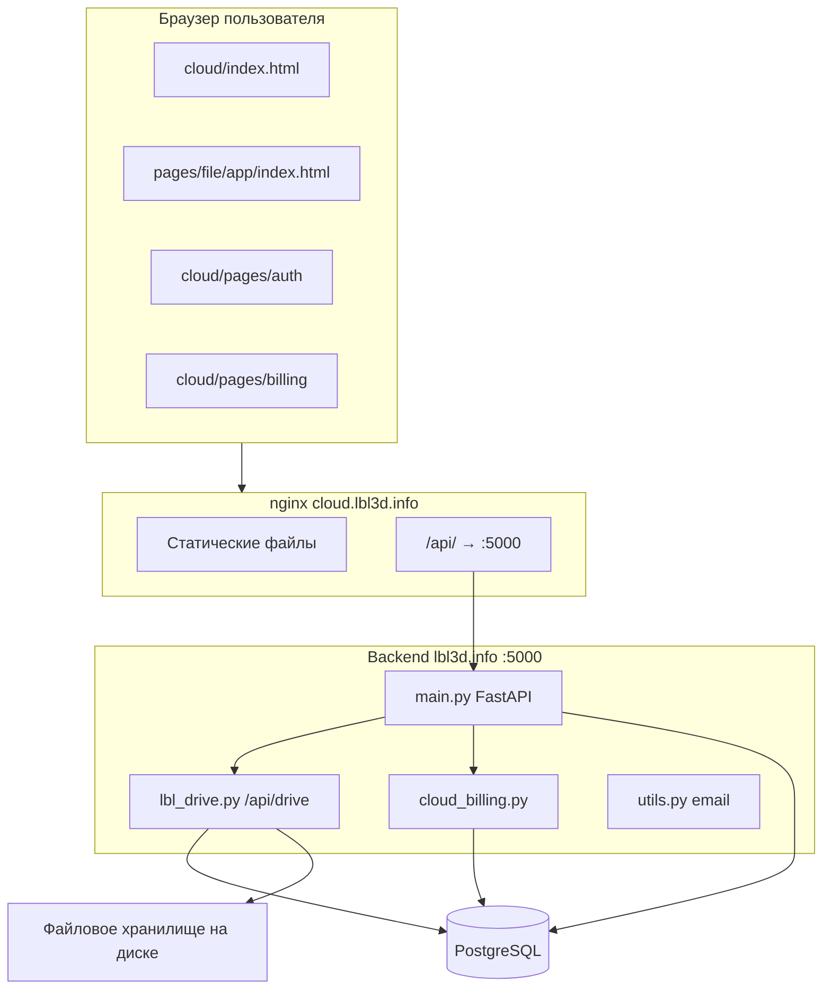
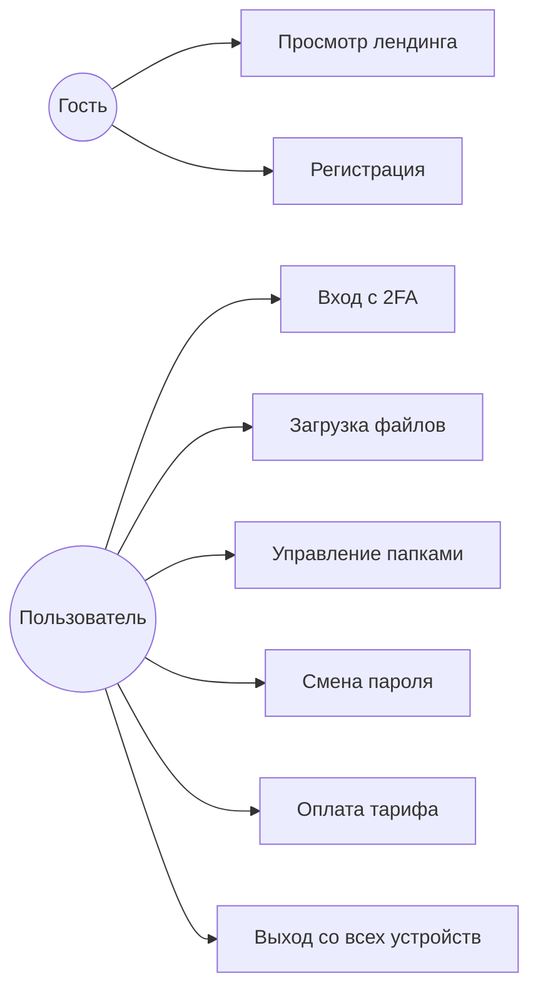

# ТЕХНИЧЕСКАЯ ДОКУМЕНТАЦИЯ (ПОЯСНИТЕЛЬНАЯ ЗАПИСКА)

## Проект: облачное хранилище «LBL Cloud»

**Дисциплина:** «Осуществление интеграции программных модулей» (или аналог по учебному плану)  
**Тема:** «Разработка веб-сервиса облачного хранилища LBL Cloud»

| | |
|---|---|
| **Выполнил** | студент группы _________ _________________ |
| **Руководитель** | _________________ |
| **Оценка** | _________________ |
| **Дата защиты** | «___» __________ 20___ г. |
| **Город, год** | __________, 2026 г. |

**Публичный адрес продукта:** https://cloud.lbl3d.info  
**Приложение «Мой диск»:** https://cloud.lbl3d.info/app/

---

## Реферат

Пояснительная записка ___ с., ___ рис., ___ табл., ___ источников, 2 прил.  
**Приложение А** содержит **15 листингов** исходного кода (HTML, CSS, JavaScript, Python, SQL, nginx).

**Ключевые слова:** ОБЛАЧНОЕ ХРАНИЛИЩЕ, ВЕБ-ПРИЛОЖЕНИЕ, ФАЙЛОВЫЙ ДИСК, HTML, CSS, JAVASCRIPT, FASTAPI, POSTGRESQL, NGINX, ДВУХФАКТОРНАЯ АУТЕНТИФИКАЦИЯ, ЗАГРУЗКА ФАЙЛОВ, ТАРИФЫ, ЛИЧНЫЙ КАБИНЕТ.

**Объект исследования** — веб-сервисы облачного хранения файлов для физических лиц и малых команд.

**Цель работы** — разработать автономный веб-сервис **LBL Cloud**, позволяющий пользователю регистрироваться и входить в систему, загружать и скачивать файлы, организовывать папки, управлять тарифом и квотой, настраивать безопасность аккаунта (2FA, смена пароля, выход со всех устройств).

**Методы и средства:** анализ предметной области, проектирование клиент-серверной архитектуры, HTML5/CSS3/JavaScript на стороне клиента, REST API на FastAPI, PostgreSQL, развёртывание через nginx.

**Результат:** работоспособный продукт на домене `cloud.lbl3d.info`: лендинг, веб-приложение `/app/`, страницы входа и регистрации, биллинг, серверное API `/api/drive/*` и `/api/cloud/billing/*`.

**Степень внедрения** — опытная эксплуатация / учебно-промышленный прототип.  
**Область применения** — хранение личных файлов, портфолио разработчика, основа для коммерческого облачного сервиса группы LBL.

---

## Содержание

1. [Введение](#введение)
2. [1 Аналитическая часть](#1-аналитическая-часть)
   - 1.1 [Описание предметной области](#11-описание-предметной-области)
   - 1.2 [Актуальность разработки](#12-актуальность-разработки)
   - 1.3 [Анализ существующих аналогов](#13-анализ-существующих-аналогов)
   - 1.4 [Постановка задачи](#14-постановка-задачи)
   - 1.5 [Требования к безопасности](#15-требования-к-безопасности)
   - 1.6 [Выводы по аналитической части](#16-выводы-по-аналитической-части)
3. [2 Проектная часть](#2-проектная-часть)
   - 2.1 [Выбор технологий](#21-выбор-технологий-разработки)
   - 2.2 [Архитектура системы](#22-архитектура-системы)
   - 2.3 [Структура репозитория](#23-структура-репозитория)
   - 2.4 [Проектирование интерфейса](#24-проектирование-пользовательского-интерфейса)
   - 2.5 [Проектирование данных](#25-проектирование-данных)
   - 2.6 [Проектирование API](#26-проектирование-api)
   - 2.7 [Диаграмма вариантов использования](#27-диаграмма-вариантов-использования)
   - 2.8 [Пользовательские сценарии](#28-проектирование-пользовательских-сценариев)
   - 2.9 [Адаптивность и доступность](#29-требования-к-адаптивности-и-доступности)
   - 2.10 [Выводы по проектной части](#210-выводы-по-проектной-части)
4. [3 Практическая часть](#3-практическая-часть)
   - 3.1 [Клиентская часть](#31-реализация-клиентской-части)
   - 3.2 [Файловый диск](#32-реализация-файлового-диска)
   - 3.3 [Аккаунт и безопасность](#33-реализация-аккаунта-и-безопасности)
   - 3.4 [Биллинг и тарифы](#34-реализация-биллинга-и-тарифов)
   - 3.5 [Серверная часть](#35-реализация-серверной-части)
   - 3.6 [Развёртывание](#36-размещение-и-запуск)
   - 3.7 [Тестирование](#37-тестирование)
   - 3.8 [Ограничения](#38-ограничения-реализации)
   - 3.9 [Выводы по практической части](#39-выводы-по-практической-части)
5. [Заключение](#заключение)
6. [Список использованных источников](#список-использованных-источников)
7. [Приложение А — листинги](#приложение-а-листинги-основных-компонентов)
8. [Приложение Б — скриншоты](#приложение-б-скриншоты-интерфейса)

---

## Введение

Облачные хранилища стали стандартным инструментом для резервного копирования, обмена файлами и совместной работы. Пользователь ожидает единый веб-интерфейс: загрузка с drag-and-drop, папки, поиск, превью, понятный тариф и защита аккаунта.

**LBL Cloud** — автономный продукт на домене `cloud.lbl3d.info`. Он не позиционируется как «раздел сайта студии»: брендинг, вход, юридические страницы и поддержка оформлены в зоне Cloud. Технически используется общий backend LBL (FastAPI + PostgreSQL), но для пользователя это единый сервис облака.

**Актуальность** связана с интеграцией программных модулей: фронтенд диска, API загрузки, модуль авторизации, биллинг, почтовые уведомления (2FA, смена пароля) и nginx-маршрутизация должны работать согласованно.

**Цель работы** — разработать и описать веб-сервис LBL Cloud с лендингом, приложением «Мой диск», личным кабинетом, безопасностью аккаунта и тарифами.

**Задачи:**

1. Проанализировать предметную область облачных хранилищ.
2. Сформулировать функциональные и нефункциональные требования.
3. Спроектировать архитектуру и структуру данных.
4. Реализовать клиентскую и серверную части.
5. Провести тестирование основных сценариев.
6. Описать развёртывание и ограничения.

**Объект исследования** — веб-сервисы облачного хранения файлов.  
**Предмет исследования** — методы построения клиент-серверного приложения с REST API и SPA-подобным интерфейсом на vanilla JavaScript.

---

## 1 Аналитическая часть

### 1.1 Описание предметной области

Облачное хранилище — информационная система, в которой пользователь размещает файлы на удалённых серверах и получает к ним доступ через браузер или клиентские программы.

**Основные сущности:**

| Сущность | Описание |
|--------|----------|
| Пользователь | Владелец аккаунта LBL Cloud ID, имеет квоту и тариф |
| Папка | Логический каталог в дереве «Мой диск» |
| Файл | Объект с именем, размером, MIME-типом, путём на диске сервера |
| Квота | Лимит объёма (например, 5 ГБ бесплатно) |
| Тариф | Набор лимитов и опций (Free, Pro, Team) |
| Сессия | Период авторизации после входа (JWT / cookie) |
| 2FA | Дополнительный код из email при входе |

**Типовой процесс:**

1. Регистрация или вход на `cloud.lbl3d.info/pages/auth/`.
2. Открытие `/app/` — обзор файлов и папок.
3. Загрузка файлов (в том числе перетаскиванием).
4. Организация в папки, поиск, фильтры.
5. При необходимости — смена тарифа на `/pages/billing/`.
6. В разделе «Аккаунт» — 2FA, смена пароля, история входов.

Для учебного и промышленного прототипа LBL Cloud реализованы базовые сценарии диска и аккаунта; расширенные функции (командные папки, десктоп-синхронизация) зафиксированы в дорожной карте (`frontend/cloud/CLOUD-APP-TZ.md`).

### 1.2 Актуальность разработки

Рост объёма личных цифровых данных (фото, документы, 3D-модели) увеличивает спрос на простые и доступные облака. Отдельный домен и бренд LBL Cloud позволяют развивать продукт независимо от витрины LBL Studio.

С точки зрения учебной практики проект демонстрирует:

- интеграцию **нескольких модулей** (UI, API, БД, почта, платежи);
- работу с **большими файлами** (чанковая загрузка);
- **безопасность** (2FA, смена пароля, журнал входов).

### 1.3 Анализ существующих аналогов

| Критерий | Google Drive | Яндекс.Диск | Dropbox | **LBL Cloud** |
|----------|--------------|-------------|---------|----------------|
| Бесплатная квота | 15 ГБ | 10+ ГБ | 2 ГБ | 5 ГБ (тариф Free) |
| Веб-интерфейс | Да | Да | Да | Да (`/app/`) |
| 2FA | Да | Да | Да | Email-код |
| Свой домен/бренд | Нет | Нет | Нет | cloud.lbl3d.info |
| Исходный код для учёбы | Закрыт | Закрыт | Закрыт | Репозиторий проекта |

**Вывод:** LBL Cloud не конкурирует по масштабу с мировыми сервисами, но подходит как **учебно-продуктовый прототип** с полным стеком и возможностью доработки.

### 1.4 Постановка задачи

**Пользовательская часть должна включать:**

- лендинг с описанием тарифов;
- вход, регистрацию, восстановление пароля;
- приложение `/app/`: диск, недавние, избранное, корзина, аккаунт;
- загрузку и скачивание файлов;
- страницу тарифов и оплаты.

**Серверная часть должна обеспечивать:**

- REST API для файлов и папок;
- учёт занятого места и лимитов тарифа;
- 2FA, смену пароля, историю входов;
- интеграцию с платёжной системой (ЮKassa) для подписок Cloud.

**Таблица 1 — Функциональные требования**

| Код | Требование | Роль |
|-----|------------|------|
| F1 | Просмотр лендинга и переход к регистрации | Гость |
| F2 | Вход / регистрация с подтверждением email | Пользователь |
| F3 | Просмотр списка файлов и папок | Пользователь |
| F4 | Создание папки, загрузка, скачивание, удаление | Пользователь |
| F5 | Корзина и восстановление | Пользователь |
| F6 | Включение 2FA, смена пароля | Пользователь |
| F7 | Просмотр тарифов и оформление подписки | Пользователь |
| F8 | Выход со всех устройств | Пользователь |

**Таблица 2 — Нефункциональные требования**

| Код | Требование | Целевое значение |
|-----|------------|------------------|
| N1 | Доступность сервиса | ≥ 99,5% (цель по ТЗ) |
| N2 | Адаптивность UI | 360–1920 px |
| N3 | Макс. размер файла (Free) | 1 ГБ на файл |
| N4 | Браузеры | Chrome, Edge, Firefox, Safari (актуальные) |
| N5 | HTTPS | Обязательно на проде |
| N6 | Время отклика API browse | < 2 с при типовой папке |

### 1.5 Требования к безопасности

| Область | Реализация в LBL Cloud | Рекомендация |
|---------|------------------------|--------------|
| Пароли | Хранение в БД в хешированном виде (backend) | bcrypt/argon2, политика сложности |
| Сессия | JWT / cookie, передача по HTTPS | Короткий TTL, refresh-токены |
| 2FA | Код на email при входе | TOTP как опция |
| Файлы | Доступ только владельцу по токену | Проверка прав на каждый запрос |
| Админ-действия | Отдельная операторская панель (lbl3d.info) | RBAC на сервере |

Персональные данные при регистрации в Cloud обрабатываются согласно политике на `cloud.lbl3d.info/pages/legal/` (152-ФЗ — согласие при регистрации).

### 1.6 Выводы по аналитической части

Определены сущности, роли и требования. Выбрана клиент-серверная модель с единым API. Проект пригоден для демонстрации интеграции модулей и дальнейшего масштабирования.

---

## 2 Проектная часть

### 2.1 Выбор технологий разработки

| Уровень | Технология | Назначение |
|---------|------------|------------|
| Разметка | HTML5 | Лендинг, `/app/`, auth, legal |
| Стили | CSS3 | Дизайн-система, адаптив, тема light/dark |
| Клиентская логика | JavaScript (ES5/ES6) | `lbl-drive.js`, `auth.js`, `landing.js` |
| Сервер | Python 3, **FastAPI** | REST API, авторизация, почта |
| БД | **PostgreSQL** | Пользователи, файлы, биллинг |
| HTTP-сервер | **nginx** | Статика, SSL, прокси `/api/` → uvicorn |
| Платежи | ЮKassa (webhook) | Подписки Cloud |
| Шрифты/иконки | Self-hosted vendor | `/vendor/fonts`, Font Awesome |

**Почему не React в `/app/`:** по ТЗ v2.0 выбран vanilla JS для прозрачности кода, простого деплоя статики и соответствия учебным целям.

### 2.2 Архитектура системы



**Принцип:** браузер не обращается к файлам других пользователей напрямую; все операции идут через API с проверкой токена.

### 2.3 Структура репозитория

| Путь | Назначение |
|------|------------|
| `frontend/cloud/index.html` | Лендинг LBL Cloud |
| `frontend/cloud/landing.css`, `landing.js` | Стили и анимации лендинга |
| `frontend/cloud/pages/auth/` | Вход, регистрация (`auth.js`, `auth.css`) |
| `frontend/cloud/pages/billing/` | Тарифы и оплата |
| `frontend/cloud/pages/legal/` | Политика, соглашение |
| `frontend/pages/file/app/index.html` | Веб-приложение «Мой диск» (`/app/`) |
| `frontend/pages/file/js/lbl-drive.js` | Логика диска, аккаунта, навигации |
| `frontend/pages/file/css/lbl-drive-*.css` | Стили Drive UI |
| `frontend/js/core/api.js` | Общий клиент API (токен, login) |
| `backend/main.py` | Точка входа FastAPI, auth, 2FA |
| `backend/lbl_drive.py` | API диска `/api/drive/*` |
| `backend/cloud_billing.py` | API `/api/cloud/billing/*` |
| `backend/utils.py` | Письма (Cloud/Studio бренды) |
| `backend/nginx-lbl3d-cloud.conf` | Конфиг nginx для cloud |

### 2.4 Проектирование пользовательского интерфейса

**Зоны интерфейса:**

1. **Лендинг** — hero, преимущества, тарифы, CTA «Начать бесплатно».
2. **`/app/`** — боковая навигация (Диск, Недавние, Избранное, Корзина, Аккаунт), верхняя панель поиска, область файлов (сетка/список).
3. **Аккаунт** — профиль, блок «Безопасность и вход» (2FA, пароль), сессии, тариф.

**Навигация в приложении** реализована через `data-section` и состояние `state.section` в `lbl-drive.js` (`drive`, `recent`, `favorites`, `trash`, `settings`).

### 2.5 Проектирование данных

**Основные таблицы (логическая модель):**

- `users` — email, пароль, `two_factor_enabled`, лимиты;
- `user_drive_folders` — дерево папок;
- `user_files` — метаданные файлов, путь, размер, `folder_id`;
- таблицы биллинга Cloud — планы, подписки, платежи (модуль `cloud_billing`).

**Файлы на диске сервера** хранятся вне БД в каталоге пользователя (`_user_drive_root` в `lbl_drive.py`).

**Клиентское хранение:**

- `localStorage`: тема (`theme`), токен входа (через `api.js`);
- не используется как основное хранилище файлов (в отличие от демо-проекта «Снэплот»).

### 2.6 Проектирование API

**Диск** (`/api/drive`, модуль `lbl_drive.py`):

| Метод | Путь | Назначение |
|-------|------|------------|
| GET | `/config` | Лимиты, квота, настройки |
| GET | `/browse` | Список папок и файлов в каталоге |
| POST | `/folders` | Создать папку |
| POST | `/upload` | Загрузка файла |
| POST | `/upload/init`, `/chunk`, `/complete` | Чанковая загрузка |
| GET | `/files/{id}/download` | Скачивание |
| GET | `/files/{id}/preview` | Превью |
| DELETE | `/files/{id}`, `/folders/{id}` | Удаление в корзину |
| POST | `/trash/.../restore` | Восстановление |

**Аккаунт** (`/api`, `main.py`):

| Метод | Путь | Назначение |
|-------|------|------------|
| POST | `/login`, `/register` | Вход и регистрация (`app_context: cloud`) |
| POST | `/2fa/enable`, `/2fa/verify`, `/2fa/disable` | Управление 2FA |
| PUT | `/change-password` | Смена пароля |
| GET | `/security/login-history` | История входов |
| POST | `/logout-all-sessions` | Выход везде |
| GET | `/me` | Профиль текущего пользователя |

**Биллинг Cloud** (`/api/cloud/billing`):

| Метод | Путь | Назначение |
|-------|------|------------|
| GET | `/plans` | Список тарифов |
| GET | `/status` | Текущая подписка и квота |
| POST | `/checkout` | Создание платежа |
| POST | `/sync-pending` | Синхронизация статуса оплаты |

### 2.7 Диаграмма вариантов использования



### 2.8 Проектирование пользовательских сценариев

**Сценарий 1 — Первый вход:** регистрация на `pages/auth/register.html` → письмо подтверждения (бренд Cloud) → вход → редирект на `/app/`.

**Сценарий 2 — Загрузка:** пользователь перетаскивает файлы в зону drop → `lbl-drive-upload.js` отправляет на `/api/drive/upload` → обновление списка и виджета квоты.

**Сценарий 3 — 2FA:** при входе API возвращает `requires_2fa` → модальное окно `#twoFactorModal` на странице входа → повторный `/login` с кодом.

**Сценарий 4 — Аккаунт:** раздел «Аккаунт» → `loadProfileAccount()` → включение 2FA, форма смены пароля, список сессий.

### 2.9 Требования к адаптивности и доступности

- Сетка файлов перестраивается на узких экранах (media queries в `lbl-drive-gdrive.css`).
- Семантические теги: `nav`, `main`, `section`, заголовки `h1–h3` в аккаунте.
- Валидная разметка: без `aria-label` на `div` без роли; списки `<ul>` вместо лишних `article` без заголовков (лендинг и `/app/` приведены к требованиям HTML-валидатора).

### 2.10 Выводы по проектной части

Спроектирована трёхзвенная архитектура: статический фронтенд, nginx, FastAPI + PostgreSQL. Определены модули, API и структура каталогов. Подготовлена основа для практической реализации.

---

## 3 Практическая часть

### 3.1 Реализация клиентской части

**Лендинг** (`frontend/cloud/index.html`):

- секции hero, возможности, сравнение, тарифы, отзывы, CTA;
- подключение `landing.css`, локальные шрифты `/vendor/fonts`.

**Приложение диска** (`frontend/pages/file/app/index.html`):

- классы `lbl-drive-app ld-ui-gdrive`;
- боковая панель `ld-sidebar`, основная область `ld-main`;
- комментарий версии UI: `LBL Cloud app UI v11` (аккаунт: 2FA, пароль).

**Скрипты:**

- `lbl-drive.js` — навигация, `driveApiCall`, рендер файлов, профиль;
- `lbl-drive-upload.js` — очередь загрузок, панель «Загрузки»;
- `auth.js` — вход/регистрация Cloud, модальное окно 2FA (`#twoFactorModal`).

### 3.2 Реализация файлового диска

Клиент запрашивает `GET /api/drive/browse?folder_id=...` и строит DOM карточек файлов (`render` в `lbl-drive.js`).

Поддерживаются:

- виды «сетка» и «список»;
- фильтры по типу (папки, изображения, документы и т.д.);
- сортировка;
- контекстное меню и панель выделения;
- инспектор файла (`#driveInspector`).

Сервер проверяет квоту через `cloud_storage_limit_mb(user)` перед загрузкой.

### 3.3 Реализация аккаунта и безопасности

В разделе **«Аккаунт»** (`#driveSettings`, `data-section="settings"`):

| Элемент | ID / класс | API |
|---------|------------|-----|
| Включение 2FA | `#profile2faToggleBtn` | `POST /api/2fa/enable`, `/verify`, `/disable` |
| Код из письма | `#profile2faCode` | тело `{ code }` |
| Смена пароля | `#profilePasswordForm` | `PUT /api/change-password` |
| История входов | `#profileLoginHistory` | `GET /api/security/login-history` |
| Выход везде | `#profileLogoutAllBtn` | `POST /api/logout-all-sessions` |

Инициализация: `initProfileSecurity()` при старте приложения, обновление при открытии аккаунта — `loadProfileAccount()`.

**Важно для эксплуатации:** блок безопасности использует класс `ld-account-card` (не общий промо-класс `ld-security-card`), чтобы старые CSS не скрывали карточки. На сервере должны быть актуальные `index.html` и `lbl-drive-profile.css` (см. `backend/deploy-cloud-app.sh`).

### 3.4 Реализация биллинга и тарифов

Страница `frontend/cloud/pages/billing/` вызывает:

- `GET /api/cloud/billing/plans`;
- `GET /api/cloud/billing/status`;
- `POST /api/cloud/billing/checkout` → редирект на оплату ЮKassa.

После webhook в `main.py` вызывается `process_cloud_payment_webhook` — обновление лимита хранилища пользователя.

### 3.5 Реализация серверной части

- **`lbl_drive.py`** — роутер `/api/drive`, схема БД `ensure_drive_schema()`.
- **`main.py`** — CORS для `cloud.lbl3d.info`, регистрация роутов, 2FA, смена пароля.
- **`utils.py`** — `resolve_email_brand()`, шаблоны писем Cloud (2FA, регистрация, сброс пароля).
- **`cloud_billing.py`** — тарифы и подписки.

Почта при регистрации Cloud содержит ссылку с `?app=cloud` для страницы `verify-email`.

### 3.6 Размещение и запуск

**Продакшен (сервер):**

```bash
# Проверка файлов приложения
bash /home/site/backend/deploy-cloud-app.sh

# Nginx
bash /home/site/backend/verify-cloud-deploy.sh

# API
bash /home/site/backend/start-api.sh

# Шрифты vendor
bash /home/site/backend/fix-cloud-vendor.sh
```

**Локально:**

```bash
python backend/dev-serve-cloud.py
# http://127.0.0.1:8766/app/?demo=1
```

| URL | Файлы |
|-----|--------|
| `/` | `frontend/cloud/` |
| `/app/` | `frontend/pages/file/app/` |
| `/pages/auth/` | `frontend/cloud/pages/auth/` |
| `/api/` | uvicorn :5000 |

### 3.7 Тестирование

**Таблица 3 — Результаты функционального тестирования (шаблон)**

| Тест-кейс | Ожидаемый результат | Статус |
|-----------|---------------------|--------|
| Открытие лендинга | Отображается cloud.lbl3d.info | + / − |
| Регистрация Cloud | Письмо, редирект, вход | + / − |
| Вход с 2FA | Модальное окно, код из почты | + / − |
| Загрузка файла | Файл в списке, квота обновлена | + / − |
| Создание папки | Папка в browse | + / − |
| Смена пароля в аккаунте | Сообщение об успехе | + / − |
| Включение 2FA | Код на email, статус «Включено» | + / − |
| Оплата тарифа (тест) | Лимит увеличен после webhook | + / − |

Рекомендуется дополнить скриншотами в **Приложении Б**.

### 3.8 Ограничения реализации

- Чанковая загрузка и превью зависят от настроек nginx (`client_max_body_size`).
- Демо-режим `?demo=1` — локальные заглушки без API (не для прода).
- Масштабирование на несколько серверов хранения не описано (единый диск).
- Командные папки и публичные ссылки — в дорожной карте, не все реализованы.

### 3.9 Выводы по практической части

Реализованы лендинг, веб-диск, авторизация с 2FA, аккаунт, API и деплой на `cloud.lbl3d.info`. Модули интегрированы через единый API и общую модель пользователя LBL.

---

## Заключение

В работе разработан и документирован веб-сервис **LBL Cloud** — облачное хранилище с автономным доменом, клиентским приложением «Мой диск», безопасностью аккаунта и тарифами.

Выполнены анализ предметной области, проектирование архитектуры и API, практическая реализация на FastAPI и JavaScript, описание развёртывания и тестирования.

**Направления развития:** десктоп-клиент, расширенный общий доступ, TOTP-2FA, увеличение SLO, вынос хранения в объектное S3-совместимое хранилище, автоматизированные e2e-тесты.

---

## Список использованных источников

1. ГОСТ 7.32–2017. Отчёт о научно-исследовательской работе. Структура и правила оформления. — М.: Стандартинформ, 2017.
2. ГОСТ 19.701–90. ЕСПД. Схемы алгоритмов, программ, данных и систем. — М.: Стандартинформ, 1992.
3. ГОСТ 34.201–2020. Виды, комплектность и обозначение документов на АС. — М.: Стандартинформ, 2020.
4. Дакетт, Дж. HTML и CSS. Разработка и дизайн веб-сайтов. — М.: Эксмо, 2023.
5. Фримен, Э., Робсон, Э. Изучаем программирование на JavaScript. — СПб.: Питер, 2022.
6. FastAPI Documentation. — URL: https://fastapi.tiangolo.com/ (дата обращения: 28.05.2026).
7. MDN Web Docs. HTML, CSS, JavaScript. — URL: https://developer.mozilla.org/ru/ (дата обращения: 28.05.2026).
8. PostgreSQL Documentation. — URL: https://www.postgresql.org/docs/ (дата обращения: 28.05.2026).
9. nginx documentation. — URL: https://nginx.org/ru/docs/ (дата обращения: 28.05.2026).
10. W3C. Web Content Accessibility Guidelines (WCAG) 2.1. — URL: https://www.w3.org/TR/WCAG21/ (дата обращения: 28.05.2026).
11. Федеральный закон № 152-ФЗ «О персональных данных» (ред. актуальная). — URL: https://pravo.gov.ru/ (дата обращения: 28.05.2026).
12. Документация ЮKassa. — URL: https://yookassa.ru/developers (дата обращения: 28.05.2026).
13. Техническое задание проекта LBL Cloud: `frontend/cloud/CLOUD-APP-TZ.md` (внутренний документ).
14. Руководство по деплою: `backend/FILE-DRIVE-DEPLOY.md` (внутренний документ).

---

## Приложение А. Листинги основных компонентов

В приложении приведены фрагменты программной реализации проекта LBL Cloud: разметка страниц, клиентская логика диска и авторизации, серверные маршруты API, схема БД, конфигурация nginx и отправка писем.

---

### Листинг А.1 — HTML-структура лендинга (hero)

```html
<!DOCTYPE html>
<html lang="ru">
<head>
    <meta charset="UTF-8">
    <meta name="viewport" content="width=device-width, initial-scale=1.0">
    <title>LBL Cloud | Ваше облако. Ваши правила.</title>
    <link rel="stylesheet" href="landing.css?v=15">
</head>
<body class="cloud-page">
    <main id="top">
        <section class="hero section-pad">
            <div class="container hero-grid">
                <div class="hero-copy reveal">
                    <h1>Ваше облако.<span>Ваши правила.</span></h1>
                    <p class="hero-lead">
                        Личный диск с папками и быстрой загрузкой.
                        Отдельный сервис LBL Cloud.
                    </p>
                    <div class="hero-actions">
                        <a class="btn btn-primary btn-large" href="#" data-lc-register>
                            Получить 5 ГБ бесплатно
                        </a>
                        <a class="btn btn-glass btn-large" href="/app/">Открыть диск</a>
                    </div>
                </div>
            </div>
        </section>
    </main>
    <script src="landing.js?v=14"></script>
</body>
</html>
```

*Источник:* `frontend/cloud/index.html` (сокращено)

---

### Листинг А.2 — Разметка приложения «Мой диск» и блока безопасности

```html
<body class="lbl-drive-app ld-ui-gdrive">
<div class="ld-shell" id="driveShell">
    <aside class="ld-sidebar ld-panel--nav">
        <nav class="ld-nav" aria-label="Разделы облака">
            <button type="button" class="ld-nav__item is-active" data-section="drive">
                <span class="ld-nav__label">Мой диск</span>
            </button>
            <button type="button" class="ld-nav__item" data-section="settings">
                <span class="ld-nav__label">Аккаунт</span>
            </button>
        </nav>
    </aside>
    <main class="ld-main">
        <section class="ld-profile is-hidden" id="driveSettings">
            <h2 class="ld-profile__section-title">Безопасность и вход</h2>
            <article class="ld-account-card" id="profileSecurityCard">
                <div class="ld-security-item">
                    <strong>2FA по email</strong>
                    <button type="button" id="profile2faToggleBtn">Включить</button>
                </div>
                <form class="ld-security-form" id="profilePasswordForm">
                    <label class="ld-security-field">
                        <span>Текущий пароль</span>
                        <input type="password" name="current" autocomplete="current-password" required>
                    </label>
                    <label class="ld-security-field">
                        <span>Новый пароль</span>
                        <input type="password" name="new" autocomplete="new-password" required>
                    </label>
                    <button type="submit" class="ld-btn ld-btn--primary">Сохранить пароль</button>
                </form>
            </article>
        </section>
    </main>
</div>
<script src="/js/core/api.js"></script>
<script src="/app/js/lbl-drive.js?v=38"></script>
</body>
```

*Источник:* `frontend/pages/file/app/index.html` (фрагмент)

---

### Листинг А.3 — Модальное окно 2FA на странице входа

```html
<div class="lc-modal lc-modal--2fa" id="twoFactorModal" aria-hidden="true">
    <div class="lc-modal__card lc-modal__card--2fa" role="dialog" aria-modal="true">
        <h2 id="twoFactorTitle">Двухфакторная проверка</h2>
        <p class="lc-modal__lead">Введите 6-значный код из письма, чтобы завершить вход в LBL Cloud.</p>
        <div class="lc-modal__2fa">
            <label class="lc-otp" for="twoFactorCode">
                <span class="lc-otp__label">Код из email</span>
                <input type="text" class="lc-otp__input" id="twoFactorCode"
                       inputmode="numeric" autocomplete="one-time-code"
                       maxlength="6" placeholder="000000">
            </label>
        </div>
        <button type="button" class="lc-auth-submit" id="twoFactorSubmit">
            Подтвердить вход
        </button>
    </div>
</div>
```

*Источник:* `frontend/cloud/pages/auth/login.html`

---

### Листинг А.4 — Состояние приложения диска (JavaScript)

```javascript
(function () {
    "use strict";

    const state = {
        folderId: null,
        view: localStorage.getItem("lbl_cloud_view") === "list" ? "list" : "grid",
        config: null,
        section: "drive",
        kind: "all",
        sort: "date-desc",
        selected: null,
        currentItems: [],
        page: 1,
        user: null,
    };

    const SECTION_LABELS = {
        drive: "Мой диск",
        recent: "Недавние",
        favorites: "Избранное",
        trash: "Корзина",
        settings: "Аккаунт",
    };
    // ...
})();
```

*Источник:* `frontend/pages/file/js/lbl-drive.js` (начало модуля)

---

### Листинг А.5 — Загрузка списка файлов (`loadBrowse`)

```javascript
function loadBrowse() {
    syncSectionUi();
    if (state.section === "settings") {
        loadBillingStatus();
        loadProfileAccount();
        return;
    }
    $("driveLoading").classList.remove("is-hidden");
    const q = ($("driveSearch").value || "").trim();
    let url = "/drive/browse?";
    if (state.folderId != null) url += "folder_id=" + state.folderId + "&";
    if (q) url += "q=" + encodeURIComponent(q);
    api.get(url)
        .then(function (data) {
            renderBreadcrumbs(data.breadcrumbs || []);
            renderGrid(data);
            updateStorage(data.storage_used_mb || 0, data.storage_limit_mb || 5120);
        })
        .catch(function (err) {
            $("driveLoading").innerHTML =
                '<p style="color:#ef4444">' + escapeHtml(err.message) + "</p>";
        });
}
```

*Источник:* `frontend/pages/file/js/lbl-drive.js`

---

### Листинг А.6 — Универсальный вызов API с клиента

```javascript
function driveApiCall(method, path, body) {
    var opts = {
        method: method,
        credentials: "include",
        headers: Object.assign({ Accept: "application/json" }, currentAuthHeaders()),
    };
    if (body !== undefined) {
        opts.headers["Content-Type"] = "application/json";
        opts.body = JSON.stringify(body);
    }
    var cm = document.cookie.match(/(?:^|; )lbl_csrf=([^;]*)/);
    if (cm && method !== "GET") {
        opts.headers["X-CSRF-Token"] = decodeURIComponent(cm[1]);
    }
    return fetch("/api" + path, opts).then(function (r) {
        return r.json().then(function (data) {
            if (!r.ok) {
                throw new Error((data && (data.detail || data.message)) || "Ошибка запроса");
            }
            return data;
        });
    });
}
```

*Источник:* `frontend/pages/file/js/lbl-drive.js`

---

### Листинг А.7 — Включение 2FA и смена пароля в аккаунте

```javascript
function initProfileSecurity() {
    if (profileSecurityInited) return;
    profileSecurityInited = true;

    $("profile2faToggleBtn").addEventListener("click", function () {
        var enabled = state.user && state.user.two_factor_enabled;
        if (enabled) {
            driveApiCall("POST", "/2fa/disable", {})
                .then(function (res) {
                    if (res.requires_code) {
                        showProfile2faCodeBlock("disable", res.message);
                    } else {
                        state.user.two_factor_enabled = false;
                        updateProfile2faUi(false);
                    }
                });
        } else {
            driveApiCall("POST", "/2fa/enable", {})
                .then(function (res) {
                    showProfile2faCodeBlock("enable", res.message);
                });
        }
    });

    $("profilePasswordForm").addEventListener("submit", function (e) {
        e.preventDefault();
        driveApiCall("PUT", "/change-password", {
            current_password: pwdForm.querySelector('[name="current"]').value,
            new_password: pwdForm.querySelector('[name="new"]').value,
        }).then(function (res) {
            setProfileSecurityStatus($("profilePasswordStatus"), res.message, "success");
            pwdForm.reset();
        });
    });
}
```

*Источник:* `frontend/pages/file/js/lbl-drive.js` (сокращено)

---

### Листинг А.8 — Вход и 2FA (клиент авторизации)

```javascript
function apiLogin(email, password, code) {
    return rawPost("/login", {
        email: email,
        password: password,
        two_factor_code: code || null,
        user_agent: navigator.userAgent || "",
        device_info: deviceInfo(),
        app_context: "cloud",
    });
}

function is2FA(response) {
    return !!(response && (
        response.requires_2fa === true ||
        response.requires_2fa === "true" ||
        response.requires_2fa === 1
    ));
}

function askTwoFactor(email, password, form) {
    twoFactorState = { email: email, password: password, form: form };
    var modal = $("twoFactorModal");
    modal.classList.add("is-open");
    modal.setAttribute("aria-hidden", "false");
    $("twoFactorCode").focus();
    setBusy(form, false);
}

$("twoFactorSubmit").addEventListener("click", function () {
    var code = $("twoFactorCode").value.trim();
    apiLogin(twoFactorState.email, twoFactorState.password, code)
        .then(function (response) {
            storeAuth(twoFactorState.email, response);
            redirectAfterAuth(response);
        });
});
```

*Источник:* `frontend/cloud/pages/auth/auth.js` (фрагменты)

---

### Листинг А.9 — CSS: карточки аккаунта (защита от скрытия)

```css
.ld-profile__panels {
    display: grid;
    grid-template-columns: minmax(0, 1.2fr) minmax(0, 0.8fr);
    gap: 12px;
}

.ld-profile__panels .ld-account-card,
.ld-ui-gdrive .ld-profile__panels .ld-account-card {
    display: flex !important;
    flex-direction: column !important;
    grid-template-columns: unset !important;
    min-height: 0 !important;
    margin-top: 0 !important;
}

.ld-account-card {
    padding: 20px 22px;
    border: 1px solid rgba(93, 93, 210, 0.14);
    border-radius: 18px;
    background: #fff;
}

.ld-otp__input {
    width: 100%;
    height: 58px;
    font-size: 28px;
    font-weight: 800;
    letter-spacing: 0.35em;
    text-align: center;
}
```

*Источник:* `frontend/pages/file/css/lbl-drive-profile.css`, `frontend/cloud/pages/auth/auth.css`

---

### Листинг А.10 — Схема БД облачного диска (SQL)

```python
def ensure_drive_schema() -> None:
    stmts = [
        """
        CREATE TABLE IF NOT EXISTS user_drive_folders (
            id SERIAL PRIMARY KEY,
            user_id INTEGER NOT NULL REFERENCES users(id) ON DELETE CASCADE,
            parent_id INTEGER REFERENCES user_drive_folders(id) ON DELETE CASCADE,
            name VARCHAR(255) NOT NULL,
            created_at TIMESTAMP DEFAULT (NOW() AT TIME ZONE 'utc'),
            updated_at TIMESTAMP DEFAULT (NOW() AT TIME ZONE 'utc')
        )
        """,
        "ALTER TABLE user_files ADD COLUMN IF NOT EXISTS folder_id INTEGER "
        "REFERENCES user_drive_folders(id) ON DELETE SET NULL",
        "ALTER TABLE user_files ADD COLUMN IF NOT EXISTS deleted_at TIMESTAMP",
        "ALTER TABLE user_files ADD COLUMN IF NOT EXISTS is_favorite BOOLEAN DEFAULT FALSE",
        """
        CREATE TABLE IF NOT EXISTS user_drive_recent (
            id SERIAL PRIMARY KEY,
            user_id INTEGER NOT NULL REFERENCES users(id) ON DELETE CASCADE,
            file_id INTEGER REFERENCES user_files(id) ON DELETE CASCADE,
            folder_id INTEGER REFERENCES user_drive_folders(id) ON DELETE CASCADE,
            accessed_at TIMESTAMP DEFAULT (NOW() AT TIME ZONE 'utc')
        )
        """,
    ]
    with engine.begin() as conn:
        for sql in stmts:
            conn.execute(text(sql))
```

*Источник:* `backend/lbl_drive.py`

---

### Листинг А.11 — API: просмотр каталога (`GET /browse`)

```python
@router.get("/browse")
async def drive_browse(
    folder_id: Optional[int] = None,
    q: Optional[str] = None,
    section: str = Query("drive", pattern="^(drive|recent|favorites|trash|shared)$"),
    current_user: User = Depends(get_current_user),
    db: Session = Depends(get_db),
):
    used = _storage_used_mb(db, current_user.id)
    limit = cloud_storage_limit_mb(current_user)
    base_resp = {
        "section": section,
        "storage_used_mb": used,
        "storage_limit_mb": limit,
    }
    # ... выборка папок и файлов по section ...
    return {
        **base_resp,
        "folders": folders,
        "files": files,
        "breadcrumbs": _breadcrumbs(db, folder),
    }
```

*Источник:* `backend/lbl_drive.py`

---

### Листинг А.12 — API: загрузка файла с проверкой квоты

```python
@router.post("/upload")
async def drive_upload_simple(
    file: UploadFile = File(...),
    folder_id: Optional[int] = Form(None),
    current_user: User = Depends(get_current_user),
    db: Session = Depends(get_db),
):
    safe_name = validate_upload(file)
    used = _storage_used_mb(db, current_user.id)
    size_bytes = await _stream_upload_to_disk(file, tmp_dest, DRIVE_MAX_BYTES)
    size_mb = size_bytes / (1024 * 1024)
    limit = cloud_storage_limit_mb(current_user)
    if used + size_mb > limit:
        raise HTTPException(
            status_code=400,
            detail=f"Недостаточно места. Лимит {limit:.0f} МБ",
        )
    uf = UserFile(
        user_id=current_user.id,
        folder_id=folder_id,
        filename=final_name,
        original_filename=file.filename or safe_name,
        file_path=final_path,
        file_size_mb=size_mb,
    )
    db.add(uf)
    db.commit()
    return {"id": uf.id, "storage_used_mb": used, "storage_limit_mb": limit}
```

*Источник:* `backend/lbl_drive.py` (сокращено)

---

### Листинг А.13 — API: 2FA и смена пароля

```python
@app.post("/api/2fa/enable")
async def enable_2fa(
    http_request: Request,
    current_user: User = Depends(get_current_user),
    db: Session = Depends(get_db),
):
    email_brand = resolve_email_brand(http_request)
    code = generate_2fa_code()
    two_fa_codes[current_user.id] = {
        "code": code,
        "expires_at": datetime.utcnow() + timedelta(minutes=10),
        "action": "enable",
    }
    send_2fa_code_email(current_user.email, code, brand=email_brand)
    return {"message": "Код подтверждения отправлен на вашу почту", "requires_code": True}


@app.put("/api/change-password")
async def change_password(
    body: ChangePasswordRequest,
    http_request: Request,
    current_user: User = Depends(get_current_user),
    db: Session = Depends(get_db),
):
    if not verify_password(body.get_old_password(), current_user.hashed_password):
        raise HTTPException(status_code=401, detail="Неверный текущий пароль")
    current_user.hashed_password = get_password_hash(body.new_password)
    current_user.password_changed_at = datetime.utcnow()
    db.commit()
    send_password_changed_notification_email(
        current_user.email,
        brand=resolve_email_brand(http_request),
    )
    return {"message": "Пароль успешно изменен."}
```

*Источник:* `backend/main.py`

---

### Листинг А.14 — Биллинг Cloud и оплата тарифа

```python
@router.post("/checkout")
async def billing_checkout(
    body: CheckoutBody,
    current_user: User = Depends(get_current_user),
    db: Session = Depends(get_db),
):
    plan_id = body.plan_id.strip()
    if plan_id not in CLOUD_PLANS:
        raise HTTPException(status_code=400, detail="Неизвестный тариф")
    plan = CLOUD_PLANS[plan_id]
    result = db.execute(
        text(
            "INSERT INTO cloud_subscriptions (user_id, plan_id, amount_rub, status) "
            "VALUES (:uid, :pid, :amt, 'pending') RETURNING id"
        ),
        {"uid": current_user.id, "pid": plan_id, "amt": plan["price_rub"]},
    )
    sub_id = result.scalar()
    payment = create_payment(
        amount_rub=plan["price_rub"],
        description=f"LBL Cloud — {plan['name']}",
        metadata={"product": "cloud_subscription", "plan_id": plan_id, "sub_id": sub_id},
    )
    return {"confirmation_url": payment["confirmation_url"]}
```

*Источник:* `backend/cloud_billing.py` (сокращено)

---

### Листинг А.15 — Письмо с кодом 2FA (бренд Cloud) и nginx

```python
def resolve_email_brand(request=None, app_context: Optional[str] = None) -> str:
    if app_context and str(app_context).lower() in ("cloud", "lbl_cloud", "lbl-cloud"):
        return "cloud"
    if request is not None:
        origin = getattr(request, "headers", {}).get("origin") or ""
        if "cloud.lbl3d.info" in origin.lower():
            return "cloud"
    return "studio"


def send_2fa_code_email(email: str, code: str, brand: str = "studio") -> bool:
    b = _email_brand_config(brand)
    subject = f"Код входа — {b['product_short']}"
    if brand == "cloud":
        intro = "Мы получили запрос на вход в LBL Cloud ID."
    # ... HTML-шаблон письма ...
    return send_email(email, subject, html_body, brand=brand)
```

```nginx
server {
    listen 443 ssl http2;
    server_name cloud.lbl3d.info;
    root /home/site/frontend/cloud;
    client_max_body_size 1024M;

    location ^~ /app/ {
        alias /home/site/frontend/pages/file/app/;
        try_files $uri $uri/ /index.html;
    }

    location /api/ {
        proxy_pass http://127.0.0.1:5000/api/;
        proxy_set_header Host $host;
        proxy_set_header X-Real-IP $remote_addr;
        proxy_read_timeout 3600s;
    }
}
```

*Источники:* `backend/utils.py`, `backend/nginx-lbl3d-cloud.conf` (фрагменты)

---

## Приложение Б. Скриншоты интерфейса

*Вставьте скриншоты при оформлении в Word/PDF.*

| Рисунок | Содержание | URL / раздел |
|---------|------------|--------------|
| Б.1 | Главная страница (лендинг) | https://cloud.lbl3d.info/ |
| Б.2 | Приложение «Мой диск» | /app/ |
| Б.3 | Загрузка файлов, панель «Загрузки» | /app/ |
| Б.4 | Раздел «Аккаунт»: 2FA и смена пароля | /app/ → Аккаунт |
| Б.5 | Страница входа с модальным окном 2FA | /pages/auth/login |
| Б.6 | Тарифы и оплата | /pages/billing/ |

---

*Документ подготовлен по структуре учебной технической документации (аналог: проект «Снэплот», курсовая работа). Для сдачи: экспорт в PDF/DOCX, подстановка ФИО, группы, рисунков и заполнение таблицы тестирования фактическими результатами.*
